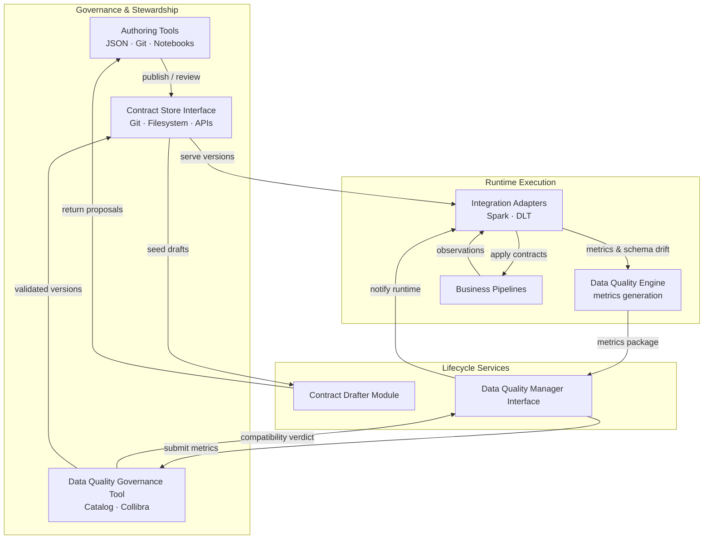

# dc43 — Data Contracts For Free!

## Overview

### Conceptual platform

dc43 is a governance-first toolkit that separates the **concepts** of data contract management from their **implementations**. At its core it provides:

- Contract lifecycle management primitives to draft, review, approve, and retire ODCS contracts. _Note: dc43 currently targets ODCS 3.0.2; a compatibility table will follow as the spec evolves._
- Extensible interfaces for contract storage, drafting, and data quality orchestration that keep governance decisions close to the data contract owner.
- Runtime helpers to apply approved specifications in compute platforms while feeding observations back to governance workflows.

### Provided integrations

On top of the conceptual platform, dc43 ships opinionated integrations that you can adopt or replace:

- Spark & DLT pipelines via `dc43.components.integration.spark_io` with schema/metric helpers from `dc43.components.data_quality` for auto-casting and contract-aware IO.
- Storage backends such as filesystem (DBFS/UC volumes), Delta tables, and Collibra through `CollibraContractStore`.
- A pluggable data-quality client with a stub implementation that can be replaced by catalog-native tools.

See [`docs/implementations/data-quality-governance/collibra.md`](docs/implementations/data-quality-governance/collibra.md) for end-to-end orchestration guidance when Collibra owns stewardship workflows. Component deep dives cover the [contract store](docs/component-contract-store.md), [contract drafter](docs/component-contract-drafter.md), [data-quality governance interface](docs/component-data-quality-governance.md), [data-quality engine](docs/component-data-quality-engine.md), and [integration layer](docs/component-integration-layer.md). Each component links to implementation catalogs under [`docs/implementations/`](docs/implementations/) so you can pick technology-specific guides (Spark, Delta, Collibra, ...).

## Component model

dc43 exposes a small set of well-defined components. Swap any of them without rewriting the rest of the stack:

| Layer | Component | Responsibility |
| --- | --- | --- |
| Governance | **Contract manager/store interface** | Retrieve, version, and persist contracts from catalog-backed or file-based sources. |
| Governance | **Data quality manager interface** | Coordinate with an external DQ governance tool (e.g., Collibra, Unity Catalog) that records dataset↔contract alignment and approval state. |
| Authoring support | **Contract drafter module** | Generate ODCS drafts from observed data or schema drift events before handing them back to governance. |
| Runtime services | **Data-quality metrics engine** | Collect contract-driven metrics in execution engines and forward them to the governance tool for status evaluation. |
| Integration | **Integration adapters** | Bridge the contract, drafter, and DQ components into execution engines such as Spark or Delta Live Tables (current adapters live under `dc43.components.integration`). |

Guides for each component live under `docs/`:

- Contract store: [`component-contract-store.md`](docs/component-contract-store.md)
- Contract drafter: [`component-contract-drafter.md`](docs/component-contract-drafter.md)
- Data-quality governance interface: [`component-data-quality-governance.md`](docs/component-data-quality-governance.md)
- Data-quality engine: [`component-data-quality-engine.md`](docs/component-data-quality-engine.md)
- Integration layer: [`component-integration-layer.md`](docs/component-integration-layer.md); Spark & DLT adapter: [`implementations/integration/spark-dlt.md`](docs/implementations/integration/spark-dlt.md)
- Write violation strategies: [`component-write-violation-strategies.md`](docs/component-write-violation-strategies.md)

## Architecture



This architecture clarifies how governance assets, lifecycle services, and runtime execution collaborate:

- Governance systems own the authoritative contract store and the data-quality tool. Labeled edges (`publish / review`, `validated versions`) highlight how those systems steer approvals.
- Lifecycle services—drafting and data-quality management—mediate between governance and runtime. The drafter turns runtime feedback into proposals while the DQ manager relays metrics, waits for a verdict, and shares compatibility context with both stewards and pipelines.
- Integration adapters inside runtime engines (Spark, DLT, …) apply contracts, emit observations, and react when governance signals change.

### Node & edge glossary

- **Contract store interface** – pluggable storage adapters (filesystem, Delta, Collibra) that resolve authoritative contract versions.
- **Data quality manager interface** – the dc43 protocol that hands metrics to the governance platform and retrieves compatibility verdicts.
- **Data quality governance tool** – catalog or observability system (Collibra, Unity Catalog, bespoke services) that persists the compatibility matrix and performs the actual check evaluation once it receives metrics.
- **Metrics package** – the bundle of row counts, expectation results, and schema drift context emitted by the runtime so the governance tool can recompute the dataset↔contract status.

Variations—such as Collibra-governed contracts or bespoke storage backends—slot into the same model by substituting implementations of the interfaces described above.

## Install

- As a source lib (Databricks Repos, workspace files) or package. No hard dependencies by default; bring your own `pyspark` on Databricks clusters.

## Quickstart

1) Define a contract (ODCS typed model)

```python
from open_data_contract_standard.model import (
    OpenDataContractStandard, SchemaObject, SchemaProperty, Description
)

contract = OpenDataContractStandard(
    version="0.1.0",
    kind="DataContract",
    apiVersion="3.0.2",
    id="sales.orders",
    name="Orders",
    description=Description(usage="Orders facts"),
    schema_=[
        SchemaObject(
            name="orders",
            properties=[
                SchemaProperty(name="order_id", physicalType="bigint", required=True, unique=True),
                SchemaProperty(name="customer_id", physicalType="bigint", required=True),
                SchemaProperty(name="order_ts", physicalType="timestamp", required=True),
                SchemaProperty(name="amount", physicalType="double", required=True),
                SchemaProperty(
                    name="currency", physicalType="string", required=True,
                    logicalTypeOptions={"enum": ["EUR", "USD"]}
                ),
            ],
        )
    ],
)
```

2) Validate and write with Spark

```python
from dc43.components.contract_store.impl.filesystem import FSContractStore
from dc43.components.integration.spark_io import (
    write_with_contract,
    StaticDatasetLocator,
)

store = FSContractStore(base_path="/mnt/contracts")

write_with_contract(
    df=orders_df,
    contract_id="sales.orders",
    contract_store=store,
    expected_contract_version=">=0.1.0",
    dataset_locator=StaticDatasetLocator(format="delta"),
    mode="append",
    enforce=True,
    auto_cast=True,
)
```

3) DLT usage (inside a pipeline notebook)

```python
import dlt
from dc43.components.integration.dlt_helpers import expectations_from_contract

@dlt.table(name="orders")
def orders():
    df = spark.read.stream.table("bronze.sales_orders_raw")
    exps = expectations_from_contract(contract)
    dlt.expect_all(exps)
    return df.select("order_id", "customer_id", "order_ts", "amount", "currency")
```

4) Store and resolve contracts

```python
from dc43.components.contract_store.impl.filesystem import FSContractStore

store = FSContractStore(base_path="/mnt/contracts")
store.put(contract)
latest = store.latest("sales.orders")
```

5) DQ/DO orchestration on read

```python
from dc43.components.integration.spark_io import (
    read_with_contract,
    StaticDatasetLocator,
)
from dc43.components.data_quality.governance.stubs import StubDQClient

dq = StubDQClient(base_path="/mnt/dq_state")
df, status = read_with_contract(
    spark,
    contract_id="sales.orders",
    contract_store=store,
    expected_contract_version="==0.1.0",
    dq_client=dq,
    dataset_locator=StaticDatasetLocator(format="delta"),
    return_status=True,
)
print(status.status, status.reason)
```

6) Quality status check on write

```python
from dc43.components.integration.spark_io import (
    write_with_contract,
    StaticDatasetLocator,
)

vr, status = write_with_contract(
    df=orders_df,
    contract_id="sales.orders",
    contract_store=store,
    expected_contract_version=">=0.1.0",
    dataset_locator=StaticDatasetLocator(format="delta"),
    mode="append",
    enforce=False,                 # continue writing
    dq_client=dq,
    return_status=True,
)
if status and status.status == "block":
    raise ValueError(f"DQ blocked write: {status.details}")
```

## Demo application

A Vue-powered FastAPI application in ``dc43.demo_app`` offers a visual way to
explore contracts, datasets and data quality results. Install the optional
dependencies and launch the app with:

```bash
pip install ".[demo]"
dc43-demo
```

Visit ``http://localhost:8000`` to:

- Browse contracts and their versions with draft/active status.
- Inspect dataset versions, their linked contract, validation status and
  detailed DQ metrics derived from contract rules.
- Highlight datasets using draft contracts and trigger validation to promote
  them.

An additional Reveal.js presentation is available at
``http://localhost:8000/static/presentation.html`` to walk through the
contract lifecycle and automation steps.

The application also exposes an example Spark pipeline in
``dc43.demo_app.pipeline`` used when registering new dataset versions. The
preconfigured scenarios are documented in
[`docs/demo-pipeline-scenarios.md`](docs/demo-pipeline-scenarios.md) including
the new split strategy example that writes ``orders_enriched::valid`` and
``orders_enriched::reject`` alongside the main dataset.

## Spark Flow (Mermaid)

```mermaid
flowchart LR
    subgraph Read
      U[User code / Notebook] --> RWC{read_with_contract}
      RWC --> SR["spark.read.format(...).load"]
      RWC --> EV["ensure_version(contract)"]
      EV --> VAL[validate_dataframe]
      VAL -->|ok| AC["apply_contract (cast/order)"]
      VAL -->|errors & enforce| E1[Raise]
      AC --> DF[DataFrame ready]
      RWC --> DQ{dq_client?}
      DQ -->|yes| GS["get_status(dataset@version, contract@version)"]
      GS -->|unknown/stale| CM[compute_metrics]
      CM --> SM[submit_metrics -> status]
      GS -->|up-to-date| SM
      SM -->|block & enforce| E2[Raise]
      SM -->|ok/warn| DF
    end

    DF --> T[Transformations / joins / aggregations]

    subgraph Write
      T --> WWC{write_with_contract}
      WWC --> V2[validate_dataframe]
      V2 -->|ok| AC2[apply_contract]
      V2 -->|errors & enforce| E3[Raise]
      V2 -->|errors & !enforce| AC2
      AC2 --> SW["spark.write.(format, options).mode.save"]
      SW --> DELTA[Delta table / UC]
      DELTA --> DQ2{dq_client?}
      DQ2 -->|yes| EVAL["evaluate_dataset"]
      EVAL -->|status block & enforce| E4[Raise]
      EVAL -->|status ok/warn| DELTA
    end

    classDef err fill:#ffe5e5,stroke:#ff4d4f,color:#000
    class E1,E2,E3,E4 err
```



Notes

- The library uses the official ODCS package and enforces `$schema` version `3.0.2` by default (configurable via `DC43_ODCS_REQUIRED`).
- Validation runs inside the Spark DQ engine: presence, types, nullability and common constraints (enum, regex, min/max, unique best-effort). The resulting ``ValidationResult`` bundles metrics and a schema snapshot so governance adapters can update compatibility matrices.
- DLT helpers translate constraints into `expect` expressions when feasible.
- DQ orchestration: the IO wrapper checks schema vs contract and consults the DQ client. If dataset version is newer than DQ’s known version, it computes the required metrics and submits them, then enforces the resulting status if requested.

Local Dev

- Install dependencies locally (match your Databricks runtime where possible):

```bash
pip install open-data-contract-standard==3.0.2 pyspark
```

- dc43 enforces `apiVersion` via `DC43_ODCS_REQUIRED` (default `3.0.2`).

# Tests

- Install test extras and run

```bash
pip install -e ".[test]"
pytest
```

# Publishing

- Push a tag `v*` on a commit in `main`.
- The workflow `.github/workflows/release.yml` runs tests, builds the package, waits for manual approval via environment `release`, publishes to PyPI, and creates a GitHub release with autogenerated notes.
- Set `PYPI_TOKEN` secret and configure the `release` environment with required reviewers.

# License

Apache 2
