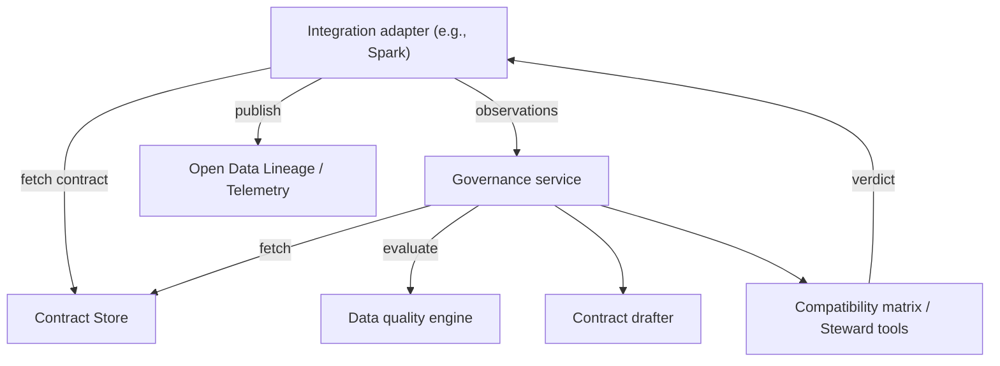

# dc43 Architecture

dc43 is designed to decouple data governance logic from runtime execution. It provides a standardized way to enforce Open Data Contract Standard (ODCS) documents across different data processing engines (like Spark) and governance backends (like Collibra, Delta, or SQL).

This document outlines the core components of the dc43 architecture and how they interact.

## Core Components

The architecture is divided into several clear responsibilities:

1.  **Integration Layer**: The runtime adapters (e.g., PySpark) that execute data pipelines.
2.  **Governance Service**: The control plane that coordinates contract enforcement and dataset lifecycles.
3.  **Data Quality Manager & Engine**: The system that evaluates data against contract expectations.
4.  **Contract Store**: The persistence layer for contract definitions (ODCS documents).
5.  **Contract Drafter**: The mechanism for proposing contract updates based on runtime observations.

---

### 1. Integration Layer

The integration layer bridges pipeline runs to the governance service. Integrations do **not** compute governance outcomes themselves—they validate the data, collect observations, and delegate the decision to the service before continuing or blocking the pipeline.

**Responsibilities:**
- Resolve runtime identifiers (paths, tables) to contract IDs.
- Validate and coerce data using the retrieved contract.
- Call the governance service with validation metrics (observations).
- Surface governance decisions (status, drafts) back to the runtime.
- Publish observability signals (Open Data Lineage, OpenTelemetry).

**Supported Integrations:**
- Apache Spark (Batch and Structured Streaming)
- Delta Live Tables (DLT)
*(For a deeper dive into how deployment topologies interact with adapters, see [Infrastructure & Adapters](infrastructure-and-adapters.md))*

**Write Violation Strategies:**
Integrations can configure how to handle data that fails validation. dc43 provides strategies to:
- **No-op**: Write everything (legacy behavior).
- **Split**: Write valid records to the primary destination and invalid records to a "reject" dataset for quarantine/remediation.
- **Strict**: Fail the pipeline if any validations do not pass, after optionally writing derived datasets.

---

### 2. Governance Service

The governance layer coordinates data-quality (DQ) verdicts and approvals alongside contract lifecycle. Integrations call this service directly—passing validation results, metrics, and pipeline context. The service then talks to contract managers, data quality engines, and draft tools.

**Responsibilities:**
- Track dataset ↔ contract links.
- Maintain a compatibility matrix between dataset versions and contract versions.
- Return an enforcement status (`ok`, `warn`, `block`) for the pipeline.
- Evaluate observation payloads (delegated to the DQ Manager).

---

### 3. Data Quality Manager & Engine

The **Data Quality Manager** is a thin façade around the evaluation engine. It normalizes observation payloads (metrics and schema) coming from integrations.

The **Data Quality Engine** interprets ODCS expectations and evaluates the normalized payloads to determine compatibility. It validates schema alignment (types, nullability) and custom rules (thresholds, uniqueness).

**Flow:**
Integration computes metrics -> Governance Service -> DQ Manager -> DQ Engine -> Verdict -> Compatibility Matrix.

---

### 4. Contract Store

The contract store resolves and stores Open Data Contract Standard (ODCS) documents.

**Responsibilities:**
- Persist ODCS documents.
- Serve contracts by id and version so integrations can enforce specific revisions.
- List and search metadata.

**Supported Backends:**
- **Filesystem**: JSON files on local disk or mounted volumes (e.g., DBFS).
- **SQL**: Relational tables via SQLAlchemy.
- **Delta Lake**: ACID tables in a lakehouse or Unity Catalog.
- **Collibra**: Full integration with Collibra Data Governance domains.

---

### 5. Contract Drafter

dc43 separates draft generation from long-term governance so pipelines can propose schema updates without bypassing steward approval.

When the integration layer encounters a schema mismatch (e.g., a new column), the governance service invokes the Drafter.
The Drafter produces an updated ODCS document marked as a draft, incrementing the semantic version, and stores it in the Contract Store. Data stewards can then review the draft in their governance tool of choice (e.g., Collibra) before the pipeline is allowed to proceed with the new schema. 

---

### End-to-End Flow

