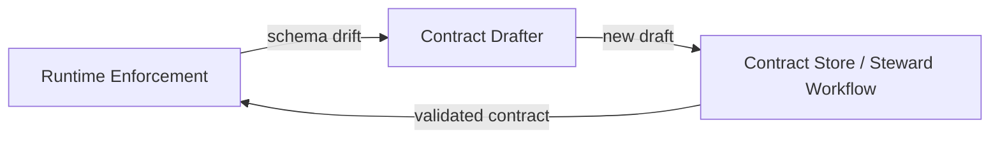

# Contract Drafter Module

dc43 separates **draft generation** from long-term governance so pipelines can propose schema updates without bypassing steward approval. The contract drafter module consumes runtime signals (Spark DataFrames, DQ feedback) and produces Open Data Contract Standard (ODCS) documents marked as drafts.

## Responsibilities

1. **Observe runtime metadata** such as Spark schemas, file layouts, and data quality verdicts when a contract mismatch is detected.
2. **Create ODCS drafts** that bump semantic versions while copying governance metadata from the source contract.
3. **Annotate provenance** (dataset id, version, feedback) so stewards understand why the draft exists and can decide whether to promote or reject it.
4. **Hand the draft back to governance** through a contract store or dedicated workflow tool (Collibra, Git-based review, etc.).



## Reference Implementation

`dc43.drafting.spark.draft_from_dataframe` turns a Spark DataFrame plus an approved contract into a new ODCS document that preserves metadata and expectations while adopting the observed schema. The helper lives in [`src/dc43/drafting/spark.py`](../src/dc43/drafting/spark.py) and powers `write_with_contract(..., draft_on_mismatch=True)`.

```python
from dc43.drafting.spark import draft_from_dataframe
from dc43.integration.spark_io import write_with_contract

draft = draft_from_dataframe(
    df=dataframe,
    base_contract=contract,
    bump="minor",
    dataset_id="table:catalog.schema.orders",
    dataset_version="2024-05-30",
)
```

The helper:

* Re-builds the contract schema based on the DataFrame.
* Bumps the semantic version (`major`/`minor`/`patch`).
* Copies IO servers and custom properties, adding provenance metadata and optional DQ feedback for stewards.

## Extending the Drafter

The Spark implementation is a starting point. You can build additional drafters for:

* **Streaming metadata**: capture schema hints from event logs or Schema Registry instead of DataFrame inspection.
* **Batch file ingestion**: read Parquet/CSV statistics to propose field-level constraints.
* **Manual authoring**: expose a UI wizard that generates the same ODCS payloads and stores them in the contract draft bucket for stewards to review.

Regardless of the implementation, surface drafts through the contract store so governance tooling can track their lifecycle.
