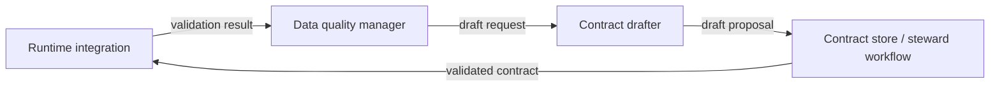

# Contract Drafter Component

dc43 separates **draft generation** from long-term governance so
pipelines can propose schema updates without bypassing steward approval.
The contract drafter consumes validation outcomes forwarded by the data
quality manager—schemas, quality feedback, and dataset lifecycle
context—and produces Open Data Contract Standard (ODCS) documents marked
as drafts.

## Responsibilities

1. **Observe runtime metadata** such as schemas, file layouts, and
   quality verdicts when a contract mismatch is detected.
2. **Create ODCS drafts** that bump semantic versions while copying
   governance metadata from the source contract.
3. **Annotate provenance** (dataset id, version, quality feedback) so
   stewards understand why the draft exists and can decide whether to
   promote or reject it.
4. **Hand the draft back to governance** through a contract store or
   dedicated workflow tool (Collibra, Git-based review, etc.).

## Interface & context requirements

A drafter should accept both the dataset identifiers and the latest
status returned by the data-quality manager. Passing the
`ValidationResult` record gives the drafter context about why a draft is
being created (for example, to remediate a blocking incompatibility).
Implementations can use this context to flag when a change addresses a
known failure versus introducing a new field.

To keep governance portable, the interface avoids tying draft creation
to any runtime or storage technology. Implementations can live inside a
catalog, a steward UI, or an automated governance workflow as long as
they produce ODCS-compliant drafts.

## Implementation catalog

Technology-specific guides live under
[`docs/implementations/contract-drafter/`](implementations/contract-drafter/).
Document each runtime adapter—such as schema registry integrations or UI
workflows—in that folder so readers can pick the implementation that
matches their environment.
