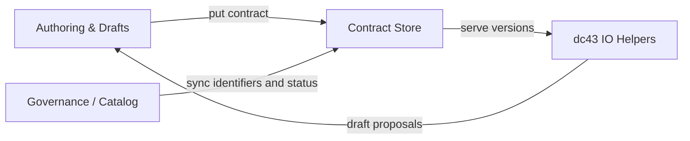

# Contract Manager / Store Component

The contract manager sits in the **governance layer** of dc43. It resolves and stores Open Data Contract Standard (ODCS) documents through a pluggable `ContractStore` interface and exposes lifecycle metadata to stewards. This guide explains the responsibilities of that component, how it fits into the architecture, and the available implementations you can mix and match with external catalogs.

## Responsibilities of a Contract Manager

Regardless of the backend, a contract manager must be able to:

1. **Persist ODCS documents** produced by authoring tools or draft workflows.
2. **Serve contracts by id and version** so Spark jobs can enforce a specific revision.
3. **List and search metadata** (identifiers, versions, timestamps) to power governance views.
4. **Expose lifecycle filters** (e.g., `Validated`, `Deprecated`) when the backend tracks status.

dc43 defines the interface in [`src/dc43_service_backends/contracts/backend/stores/interface.py`](../src/dc43_service_backends/contracts/backend/stores/interface.py):

```python
from dc43_service_backends.contracts.backend.stores.interface import ContractStore
from open_data_contract_standard.model import OpenDataContractStandard

class MyStore(ContractStore):
    def put(self, contract: OpenDataContractStandard) -> None: ...
    def get(self, contract_id: str, version: str) -> OpenDataContractStandard: ...
    def list_contracts(self) -> list[str]: ...
    def list_versions(self, contract_id: str) -> list[str]: ...
```

`write_with_contract` and `read_with_contract` call these methods to resolve the right specification during enforcement or
when promoting drafts. The store can additionally override `latest(...)` if it needs custom ordering (e.g., by status).



## Built-in Implementations

| Store | Ideal Use Case | Characteristics |
| --- | --- | --- |
| [`FSContractStore`](../src/dc43_service_backends/contracts/backend/stores/filesystem.py) | Simple deployments, Databricks Repos, dev/test | Persists JSON files under a base path (DBFS, mounted volume). Easy to inspect and version with Git or object storage. |
| [`DeltaContractStore`](../src/dc43_service_backends/contracts/backend/stores/delta.py) | Teams standardizing on Delta or Unity Catalog | Stores contracts and metadata rows inside a Delta table. Supports ACID writes, SQL discovery, and time travel. Requires `pyspark`. |
| [`CollibraContractStore`](../src/dc43_service_backends/contracts/backend/stores/collibra.py) | Organizations with Collibra-driven governance | Delegates storage and lifecycle to Collibra via the `CollibraContractAdapter`. Allows filtering by Collibra status (Draft, Validated, Deprecated) and can share workflows with Collibra stewards. Compatibility aliases for the old gateway naming remain available. |

## Integrating Other Backends

The interface is intentionally small so you can plug in other catalogs:

* **Git-based registry**: Serialize ODCS documents to Git (similar to FS) and use branch protection or PR workflows for approval.
* **REST/GraphQL services**: Wrap existing contract registries or internal metadata APIs. Cache responses locally if latency is a concern.
* **Object storage with manifests**: Store JSON in S3/ADLS and maintain a manifest table (Glue, Hive) for faster search.

When adding a new backend, consider:

* **Version semantics**: Align on semantic versioning (dc43 uses `major.minor.patch`). Implement guards to avoid downgrades.
* **Lifecycle metadata**: If the backend tracks status, surface filters so enforcement can opt-in to `Validated` contracts only.
* **Schema evolution**: Provide optimistic concurrency or merge semantics so drafts do not clobber approved versions.
* **Security & auditability**: Ensure writes are authenticated and leave an audit trail (access logs, change history).

## References

* Open Data Contract Standard 3.0.2: <https://opendatacontract.org/>
* Delta Lake tables and metadata: <https://docs.databricks.com/en/delta/index.html>
* Collibra Data Products — Data Contracts: <https://productresources.collibra.com/docs/collibra/latest/Content/Assets/DataProducts/co_data-product.htm>

## Implementation catalog

Guides for existing stores live under
[`docs/implementations/contract-store/`](implementations/contract-store/):

- [Filesystem store](implementations/contract-store/fs.md)
- [Delta-backed store](implementations/contract-store/delta.md)
- [Collibra-backed store](implementations/contract-store/collibra.md)

Document additional backends (REST services, Git, object storage, …)
in the same folder so platform teams can compare capabilities and
operational requirements.
