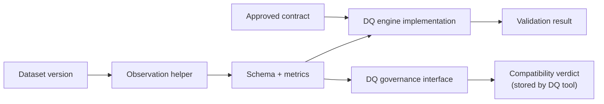

# Data Quality Engine Component

dc43 ships a runtime-agnostic evaluation engine plus execution-specific
helpers that collect observations. Together they form the **data-quality
component**: collectors gather schema snapshots and metrics from the
running job, while the engine turns those observations into verdicts the
governance layer can persist.

## Responsibilities

1. **Interpret ODCS expectations** defined on schema properties and
   objects.
2. **Describe observation requirements** so integrations know which
   metrics must be produced for a contract (null checks, thresholds,
   enumerations, uniqueness...).
3. **Validate schema compatibility** (presence, type alignment,
   nullability) and evaluate observation payloads for expectation
   violations.
4. **Bundle runtime context**—schema snapshots, dataset identifiers,
   sampling hints—so governance tools can reproduce or explain a verdict.
5. **Expose validation results** to the governance-facing `DQClient`,
   which in turn updates the compatibility matrix and stores the
   pass/block status.
6. **Optionally run inline gates** when a platform mandates local checks
   (e.g., DLT expectations). Those gates remain configurable so the
   source of truth stays within the governance tool.

The component intentionally avoids prescribing a single execution
technology. Spark, SQL warehouses, Soda, Great Expectations, or in-house
rule engines can all satisfy the same contract as long as they emit
metrics and schema snapshots consumable by the governance interface.

## Implementation catalog

Technology-specific guides live under
[`docs/implementations/data-quality-engine/`](implementations/data-quality-engine/):

- [Spark data-quality engine](implementations/data-quality-engine/spark.md)

Document alternative engines (Soda, Great Expectations, warehouses, ...)
in the same folder when you introduce them so users can evaluate which
runtime best matches their platform.
