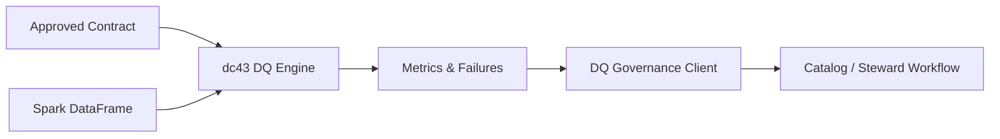

# Data Quality Processors & Engine

dc43 ships runtime helpers that translate contract rules into concrete metrics and status updates. Together they form the **data quality engine** that sits in the execution layer and feeds observations back to governance.

## Responsibilities

1. **Interpret ODCS expectations** defined on schema properties and objects.
2. **Compute metrics** (row counts, expectation violations, custom queries) against the live dataset.
3. **Decorate DQ verdicts** with failure details to aid triage.
4. **Submit results** to the governance-facing `DQClient` so the compatibility matrix stays fresh.



## Spark Reference Engine

The default implementation lives in [`src/dc43/dq/engine/spark.py`](../src/dc43/dq/engine/spark.py) and is composed of three helpers:

* `expectations_from_contract(contract)` — returns SQL predicates for field-level expectations.
* `compute_metrics(df, contract)` — executes the predicates plus uniqueness checks and schema-level queries.
* `attach_failed_expectations(df, contract, status)` — enriches a `DQStatus` with failed expectations and optional sample rows.

```python
from dc43.dq.engine.spark import compute_metrics, attach_failed_expectations
from dc43.dq.interface import DQStatus

metrics = compute_metrics(df, contract)
status = dq_client.submit_metrics(
    contract=contract,
    dataset_id="table:catalog.schema.orders",
    dataset_version="2024-05-30",
    metrics=metrics,
)
status = attach_failed_expectations(df, contract, status, collect_examples=True)
```

## Extending the Engine

* **Alternate compute engines**: Build adapters for SQL warehouses, pandas, or streaming frameworks by re-implementing the helpers above.
* **Domain-specific metrics**: Extend the returned dictionary with domain KPIs (`metrics["domain.on_time_shipment"]`).
* **Observability sinks**: Forward metrics to external monitoring platforms before invoking `DQClient.submit_metrics`.

When replacing the engine, keep the metric naming conventions (`violations.*`, `query.*`) or adapt the receiving `DQClient` to your schema.
