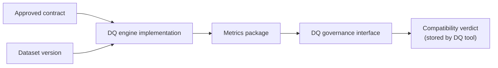

# Data Quality Engine Component

dc43 ships runtime helpers that translate contract rules into concrete
metrics and runtime context. Together they form the **data-quality
engine** that sits close to execution engines and feeds observations back
to governance for evaluation.

## Responsibilities

1. **Interpret ODCS expectations** defined on schema properties and
   objects.
2. **Compute metrics** (row counts, expectation violations, custom
   queries) against the live dataset.
3. **Bundle runtime context**—dataset version, schema drift, sampling
   hints—so governance tools can reproduce or explain a verdict.
4. **Forward metrics** to the governance-facing `DQClient`, which in turn
   updates the compatibility matrix and computes the pass/block status.
5. **Optionally run inline gates** when a platform mandates local checks
   (e.g., DLT expectations). Those gates should remain configurable so
   the source of truth stays within the governance tool.

The component intentionally avoids prescribing a single execution
technology. Spark, SQL warehouses, Soda, Great Expectations, or in-house
rule engines can all satisfy the same contract as long as they emit
metrics consumable by the governance interface.

## Implementation catalog

Technology-specific guides live under
[`docs/implementations/data-quality-engine/`](implementations/data-quality-engine/):

- [Spark engine](implementations/data-quality-engine/spark.md)

Document alternative engines (Soda, Great Expectations, warehouses, ...)
in the same folder when you introduce them so users can evaluate which
runtime best matches their platform.
