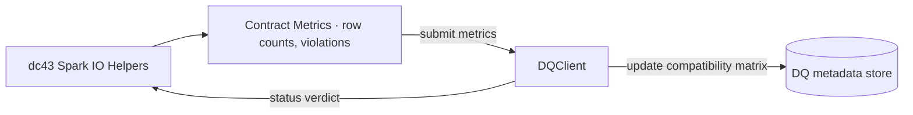

# Data Quality Governance Interface

The governance layer coordinates data-quality (DQ) verdicts and approvals alongside contract lifecycle. dc43 exposes a `DQClient` protocol so you can connect authoring and runtime workflows with catalog-native quality tools. This document explains the responsibilities of that interface and outlines implementation choices ranging from the bundled filesystem stub to production-grade monitoring platforms.

## What the DQ Component Does

A DQ client acts as the control plane for schema enforcement outcomes. At minimum it must be able to:

1. **Track dataset ↔ contract links** so downstream readers know which specification governs a dataset version.
2. **Maintain a compatibility matrix** between dataset versions and contract versions to surface the latest validated pairings and highlight drifts that require action.
3. **Return a status** (`ok`, `warn`, `block`, or `unknown`) indicating whether the dataset version satisfies the contract.
4. **Receive metrics** (e.g., row counts, expectation violations) emitted by Spark or DLT so it can compute or update the status.

dc43 interacts with the component through the `DQClient` protocol (`src/dc43/dq/interface.py`):

```python
from dc43.dq.interface import DQClient, DQStatus

class MyDQClient(DQClient):
    def get_status(self, *, contract_id, contract_version, dataset_id, dataset_version) -> DQStatus:
        ...

    def submit_metrics(self, *, contract, dataset_id, dataset_version, metrics) -> DQStatus:
        ...

    def link_dataset_contract(self, *, dataset_id, dataset_version, contract_id, contract_version) -> None:
        ...

    def get_linked_contract_version(self, *, dataset_id) -> str | None:
        ...
```

A client can be wired into `read_with_contract` and `write_with_contract` so enforcement paths look like:



The compatibility matrix is the source dc43 queries before serving data. It records the latest known contract for every dataset version alongside the DQ verdict, enabling governance tools to visualise whether a dataset version is approved for consumption under a specific contract.

## Available Implementations

| Option | When to Use | Notes |
| --- | --- | --- |
| [`StubDQClient`](../src/dc43/dq/stubs/fs.py) | Local development, demos, CI | Stores statuses and links on the filesystem. Implements naive violation counting and can block or warn on mismatches. |
| Spark metrics sink + custom adapter | Teams with in-house observability platforms (e.g., Datadog, Prometheus) | Build a thin client that forwards metrics to the existing platform, computes pass/fail thresholds, and persists verdicts for `get_status`. |
| Delta Live Tables expectations | Pipelines already using DLT expectations and event logs | Parse `event_log` expectation metrics, submit them through a client, and push verdicts back into Collibra, a Delta table, or another catalog. DLT exposes violations via the `flow_progress` events.|
| [Great Expectations](https://greatexpectations.io/) or similar rule engines | Need declarative, reusable expectations with dashboards | Wrap GX validation results in the `DQStatus` schema. Store run metadata (checkpoint, batch identifiers) in the DQ system so dc43 can retrieve them. |
| Collibra quality workflows | Organizations standardizing on Collibra | Model the compatibility matrix inside Collibra (e.g., custom attributes on Data Product ports) and drive lifecycle changes via Collibra's workflow engine. `submit metrics` transitions the workflow, which in turn updates the contract status and notifies pipelines through webhooks or polling. |

## Designing a Production DQ Adapter

When implementing a new client, keep the following in mind:

* **Idempotency**: `submit_metrics` may be called multiple times for the same dataset version. Make sure updates overwrite prior status instead of duplicating entries.
* **Metric mapping**: dc43 forwards raw metrics as a dictionary. Establish a convention (e.g., `violations.expectation_name`) so the adapter can distinguish blocking and warning rules and update the compatibility matrix accordingly.
* **Access control**: Dataset identifiers often map to storage paths or table names. Store secrets (API keys, tokens) in Databricks secrets or another vault.
* **Asynchronous workflows**: `get_status` can return `unknown` while downstream validation jobs run. Callers can retry or poll before promoting data. The compatibility matrix should retain the last confirmed status so consumers do not accidentally downgrade.

## External DQ Orchestrator

In many deployments the DQ client is a thin adapter that proxies to a dedicated observability platform responsible for the compatibility matrix, remediation workflows, and downstream notifications.

1. **Dataset ingests contract change**: When a new contract version is published, the orchestrator records a pending matrix entry (dataset version ↔ contract version) with status `unknown`.
2. **Pipelines submit metrics**: dc43 sends enforcement metrics that the orchestrator evaluates against thresholds or rules engines (Great Expectations, DLT, in-house checks).
3. **Verdict propagation**: The orchestrator updates the matrix entry to `ok`, `warn`, or `block` and emits notifications (Slack, Jira, email) if action is needed.
4. **Consumer gating**: dc43's `get_status` call reads the matrix before returning data to consumers, ensuring they only see versions that meet the required quality gate.

Collibra can fulfil the orchestrator role by persisting the matrix as relations between Data Product ports, contract versions, and dataset versions. Validation workflows in Collibra can be configured to wait for metric submissions, require steward approval, and finally transition contracts to `Validated`. When the workflow completes, a webhook can trigger a Databricks job to reprocess data or notify consumers that the dataset is compliant.

## References

* Delta Live Tables expectations and event log: <https://docs.databricks.com/en/delta-live-tables/expectations.html>
* Databricks quality & observability patterns: <https://docs.databricks.com/en/delta-live-tables/observability.html>
* Great Expectations architecture: <https://docs.greatexpectations.io/docs/>
* Collibra Data Products — Data Contracts: <https://productresources.collibra.com/docs/collibra/latest/Content/Assets/DataProducts/co_data-product.htm>
