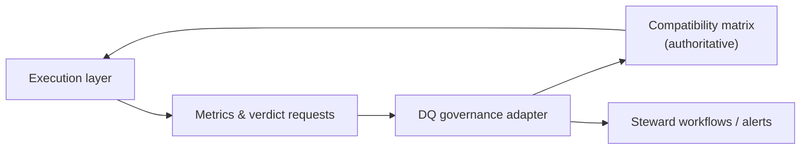

# Data Quality Governance Component

The governance layer coordinates data-quality (DQ) verdicts and approvals
alongside contract lifecycle. dc43 exposes a `DQClient` protocol so you
can connect authoring and runtime workflows with catalog-native quality
services. This document explains the responsibilities of that interface
and points to concrete adapters.

## What the component does

A DQ client acts as the control plane for schema enforcement outcomes.
At minimum it must be able to:

1. **Track dataset ↔ contract links** so downstream readers know which
   specification governs a dataset version.
2. **Maintain a compatibility matrix** between dataset versions and
   contract versions to surface the latest validated pairings and
   highlight drifts that require action.
3. **Return a status** (`ok`, `warn`, `block`, or `unknown`) indicating
   whether the dataset version satisfies the contract.
4. **Receive metrics** emitted by the DQ engine so it can compute or
   update the status **and persist the compatibility matrix entry** for
   the dataset↔contract pair.

The compatibility matrix is the source dc43 queries before serving data.
It records the latest known contract for every dataset version alongside
the DQ verdict, enabling governance tools to visualise whether a dataset
version is approved for consumption under a specific contract.

## Design considerations

* **Idempotency** – `submit_metrics` may be called multiple times for the
  same dataset version. Updates should overwrite prior status rather than
  duplicating entries.
* **Metric mapping** – establish a convention (e.g.,
  `violations.expectation_name`) so the adapter can distinguish blocking
  and warning rules.
* **Access control** – dataset identifiers often map to storage paths or
  table names. Store secrets (API keys, tokens) in a secure vault.
* **Asynchronous workflows** – `get_status` can return `unknown` while
  downstream validation jobs run. Callers can retry or poll before
  promoting data. The compatibility matrix should retain the last
  confirmed status so consumers do not downgrade inadvertently.

## Implementation catalog

Technology-specific guides live under
[`docs/implementations/data-quality-governance/`](implementations/data-quality-governance/):

- [Filesystem stub client](implementations/data-quality-governance/stub.md)
- [Collibra quality workflows](implementations/data-quality-governance/collibra.md)

When you build adapters for Soda, Great Expectations, Datadog, or other
platforms, document them in the same folder to describe how they manage
the compatibility matrix and steward notifications.
