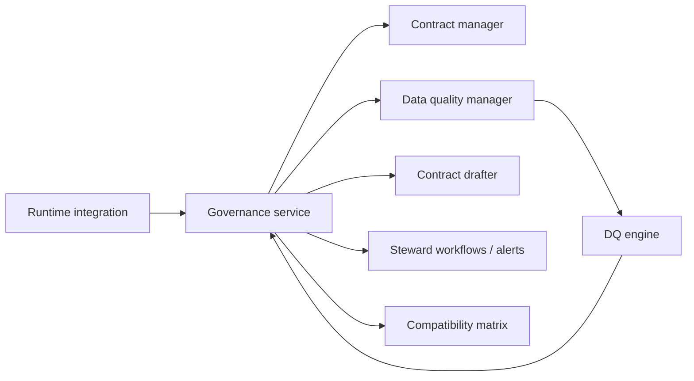

# Data Quality Governance Component

The governance layer coordinates data-quality (DQ) verdicts and approvals
alongside contract lifecycle. dc43 exposes a `GovernanceServiceClient`
that orchestrates contract lookups, quality evaluation, draft generation,
and pipeline activity recording. Integrations now call this service
directly—passing validation results, metrics, and pipeline context—while
the service talks to contract/draft managers and a dedicated
`DataQualityServiceClient`.

The separation keeps the orchestration logic thin in pipelines. dc43 ships
local stubs (`LocalContractServiceClient`, `LocalDataQualityServiceClient`)
that fulfil the service contracts in-process while mirroring the remote
APIs that production deployments implement over HTTP or RPC.

## What the component does

The service acts as the control plane for schema enforcement outcomes. At
minimum it must be able to:

1. **Track dataset ↔ contract links** so downstream readers know which
   specification governs a dataset version.
2. **Maintain a compatibility matrix** between dataset versions and
   contract versions to surface the latest validated pairings and
   highlight drifts that require action.
3. **Return a status** (`ok`, `warn`, `block`, or `unknown`) indicating
   whether the dataset version satisfies the contract.
4. **Evaluate observation payloads** by delegating to the data-quality
   manager and persist the refreshed status (including draft proposals
   when validation fails).

The compatibility matrix is the source dc43 queries before serving data.
It records the latest known contract for every dataset version alongside
the DQ verdict, enabling governance tools to visualise whether a dataset
version is approved for consumption under a specific contract.

## Design considerations

* **Idempotency** – `submit_metrics` may be called multiple times for the
  same dataset version. Updates should overwrite prior status rather than
  duplicating entries.
* **Metric mapping** – establish a convention (e.g.,
  `violations.expectation_name`) so the adapter can distinguish blocking
  and warning rules.
* **Access control** – dataset identifiers often map to storage paths or
  table names. Store secrets (API keys, tokens) in a secure vault.
* **Asynchronous workflows** – `get_status` can return `unknown` while
  downstream validation jobs run. Callers can retry or poll before
  promoting data. The compatibility matrix should retain the last
  confirmed status so consumers do not downgrade inadvertently.

## Implementation catalog

Technology-specific guides live under
[`docs/implementations/data-quality-governance/`](implementations/data-quality-governance/):

- [Filesystem stub client](implementations/data-quality-governance/stub.md)
- [Collibra quality workflows](implementations/data-quality-governance/collibra.md)

When you build adapters for Soda, Great Expectations, Datadog, or other
platforms, document them in the same folder to describe how they manage
the compatibility matrix and steward notifications.
