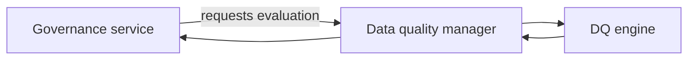

# Data Quality Manager Component

The data quality manager is the thin façade around the governance engine.
It evaluates observation payloads (metrics and schema information) using
the runtime-agnostic rules defined in an Open Data Contract. All
orchestration—status retrieval, dataset linking, draft generation—now
resides in the **governance service**. Pipelines therefore only use the
manager when the service needs a validation outcome derived from cached
observations.

## Responsibilities

1. **Normalise observation payloads** so metrics and schema snapshots are
   passed to the validation engine in a consistent shape.
2. **Evaluate expectations** declared in the contract via
   `dc43.components.contract_validation`, returning a `ValidationResult`
   that lists errors, warnings, and derived metrics.
3. **Expose engine configuration knobs** (`strict_types`,
   `allow_extra_columns`, `expectation_severity`) so governance services
   can reuse the same evaluator across pipelines.

The manager no longer talks to governance clients or persists drafts. It
simply converts cached observations into validation results so the
governance service can decide how to act. This keeps runtime adapters
agnostic of the underlying engine while avoiding tight coupling to
governance workflows.

### Core APIs

- `evaluate` accepts an `ObservationPayload` (metrics, optional schema,
  reused flag) and an Open Data Contract. It returns a `ValidationResult`
  that downstream services can interpret as `ok`, `warn`, or `block`.
- `ObservationPayload` (from `dc43.lib`) is the
  convenience dataclass used by integrations and governance services to
  package cached observations in a structured way.

Governance services call these APIs when they receive metrics from the
integration layer. The resulting validation outcome feeds the rest of the
governance pipeline (status evaluation, draft generation, steward
notifications) without requiring the integration to understand those
workflows.
