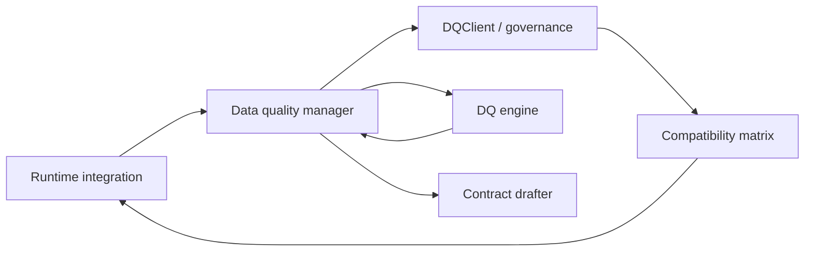

# Data Quality Manager Component

The data quality manager is the façade that integrations call to obtain
verdicts about dataset versions. It sits between runtime adapters,
external governance services, and the data-quality engine. Pipelines
never talk to the governance API directly—instead they hand observations
to the manager and receive the latest status or draft proposal.

## Responsibilities

1. **Resolve dataset status** for a dataset ↔ contract pair using the
   configured `DQClient` (compatibility matrix, steward workflows, etc.).
2. **Request validation** from the data-quality engine when the status is
   unknown or stale, then persist the refreshed verdict through the
   governance client.
3. **Propose draft contracts** when validation fails or when a dataset is
   observed without an existing contract, delegating to the contract
   drafter.
4. **Bundle governance feedback** (status, reasons, metrics, draft
   metadata) and hand it back to the integration layer so pipelines can
   decide whether to continue or stop.

The manager encapsulates orchestration logic, keeping integrations
runtime-focused and governance tools authoritative. Implementations can
wrap filesystem stubs, Collibra workflows, or bespoke quality services by
supplying a `DQClient` that fulfils the protocol.

### Core APIs

- `review_validation_outcome` receives a validation result from the
  integration and, when a draft is requested, produces a proposal through
  the contract drafter component (or forwards the request to governance).
- `evaluate_dataset` accepts the dataset identifiers, the contract, and a
  callable that lazily supplies observation metrics. The manager checks
  the stored status, refreshes it through the engine when it is unknown or
  stale, and returns both the latest `DQStatus` and any draft proposal
  created because of a governance violation.

Integrations simply call these APIs and react to the returned status—they
do not link datasets to contracts or decide when drafts are created.
