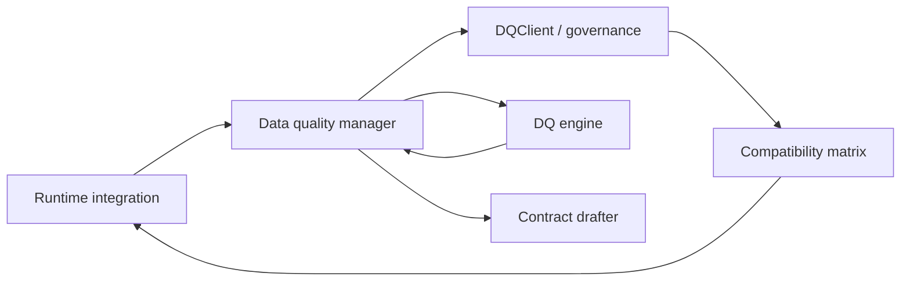

# Data Quality Manager Component

The data quality manager is the façade that integrations call to obtain
verdicts about dataset versions. It sits between runtime adapters,
external governance services, and the data-quality engine. Pipelines
never talk to the governance API directly—instead they hand observations
to the manager and receive the latest status or draft proposal.

## Responsibilities

1. **Resolve dataset status** for a dataset ↔ contract pair using the
   configured `DQClient` (compatibility matrix, steward workflows, etc.).
2. **Request validation** from the data-quality engine when the status is
   unknown or stale, then persist the refreshed verdict through the
   governance client.
3. **Propose draft contracts** when validation fails or when a dataset is
   observed without an existing contract, delegating to the contract
   drafter.
4. **Maintain dataset ↔ contract links** so future reads know which
   specification governs a dataset version.
5. **Aggregate feedback** (status, reasons, metrics) and hand it back to
   the integration layer so pipelines can decide whether to continue or
   stop.

The manager encapsulates orchestration logic, keeping integrations
runtime-focused and governance tools authoritative. Implementations can
wrap filesystem stubs, Collibra workflows, or bespoke quality services by
supplying a `DQClient` that fulfils the protocol.
