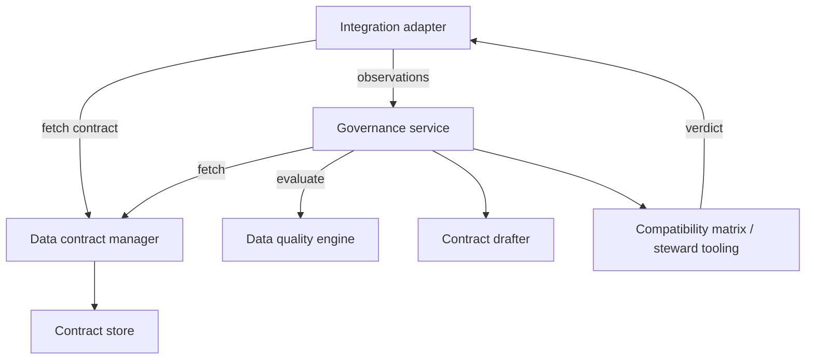

# Integration Layer Component

dc43 keeps governance logic decoupled from runtime execution. The
integration layer provides runtime-specific adapters (Spark, warehouses,
streaming engines, APIs, …) that bridge pipeline runs to the contract
manager and the remote governance coordination service. Integrations do
**not** compute governance outcomes themselves—they validate the data,
collect observations, and delegate the decision to the service before
continuing or blocking the pipeline.

## Responsibilities

1. **Resolve runtime identifiers** (paths, tables, dataset versions) and
   map them to contract ids supplied by the data contract manager.
2. **Validate and coerce data** using the retrieved contract while
   respecting enforcement flags.
3. **Call the governance service** with validation metrics so it can
   consult the contract manager, data-quality engine, and draft tooling.
4. **Surface governance decisions** (status, drafts, recorded
   provenance) back to the runtime so pipelines can block, warn, or
   persist draft proposals alongside the dataset version.
5. **Expose ergonomic APIs** for orchestrators—wrapping multiple
   component calls behind a simple read/write interface.

Adapters should stay thin: they orchestrate the component interfaces
rather than re-implementing them. Implementations can target Spark, SQL
warehouses, streaming frameworks, REST services, or ELT tools.

## Implementation catalog

Technology-specific guides live under
[`docs/implementations/integration/`](implementations/integration/):

- [Spark & DLT adapter](implementations/integration/spark-dlt.md)

Document additional adapters (Snowflake, Flink, dbt, …) in the same
folder so engineering teams can adopt the runtime that matches their
platform.
