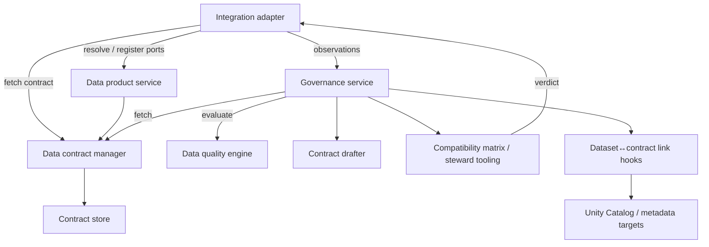

# Integration Layer Component

dc43 keeps governance logic decoupled from runtime execution. The
integration layer provides runtime-specific adapters (Spark, warehouses,
streaming engines, APIs, …) that bridge pipeline runs to the contract
manager and the remote governance coordination service. Integrations do
**not** compute governance outcomes themselves—they validate the data,
collect observations, and delegate the decision to the service before
continuing or blocking the pipeline.

## Responsibilities

1. **Resolve runtime identifiers** (paths, tables, dataset versions) and
   map them to contract ids supplied by the data contract manager.
2. **Register and resolve data product bindings** so ODPS input/output
   ports remain in sync with contract versions exposed by governance
   services.
3. **Validate and coerce data** using the retrieved contract while
   respecting enforcement flags.
4. **Call the governance service** with validation metrics so it can
   consult the contract manager, data-quality engine, and draft tooling.
5. **Surface governance decisions** (status, drafts, recorded
   provenance) back to the runtime so pipelines can block, warn, or
   persist draft proposals alongside the dataset version.
6. **Expose ergonomic APIs** for orchestrators—wrapping multiple
   component calls behind a simple read/write interface.

Adapters should stay thin: they orchestrate the component interfaces
rather than re-implementing them. Implementations can target Spark, SQL
warehouses, streaming frameworks, REST services, or ELT tools.

## Data product bindings and draft enforcement

Spark pipelines can now declare Open Data Product Standard (ODPS) bindings when
calling the integration helpers. Dedicated wrappers surface the most common
flows:

- `read_from_contract` / `write_with_contract_id` accept contract identifiers
  directly, keeping the signature laser-focused on contract lookups and
  validation knobs.
- `read_from_data_product` / `write_to_data_product` resolve contracts directly
  from the data product service when a binding points at an existing port.

All helpers forward to `read_with_contract` / `write_with_contract` under the
hood so callers can mix and match parameters as needed. Passing both a binding
and a contract id continues to pin the run to the requested contract while
recording the port metadata.

Whenever a read or write registers a new input/output port the integration
layer aborts the pipeline: the service returns a draft ODPS document and dc43
raises to guarantee the draft is reviewed before the pipeline is rerun. The
registration payload includes the draft version so orchestration logs can point
data stewards at the exact ODPS revision that needs attention. Pipelines that
should continue must pre-register their ports or run a preparatory job that
creates the draft out-of-band.

The data product backend ships with the in-memory implementation used by tests,
a filesystem-backed variant (`FilesystemDataProductServiceBackend`) that
serialises ODPS documents as JSON compliant with the official schema, and a
Collibra-aware backend (`CollibraDataProductServiceBackend`). The latter pairs
with either `StubCollibraDataProductAdapter`—a filesystem stub suitable for
local development—or `HttpCollibraDataProductAdapter` when pointing at a live
Collibra deployment. This makes it easy to capture the resulting draft
documents alongside contract files in source control or wire the same pipeline
to Collibra without code changes.

> Run `pytest packages/dc43-integrations/tests/test_integration.py -k
> data_product_pipeline_roundtrip -q` to exercise the full
> “data product → intermediate contract → data product” hand-off.

## Implementation catalog

Technology-specific guides live under
[`docs/implementations/integration/`](implementations/integration/):

- [Spark & DLT adapter](implementations/integration/spark-dlt.md)

Document additional adapters (Snowflake, Flink, dbt, …) in the same
folder so engineering teams can adopt the runtime that matches their
platform.
