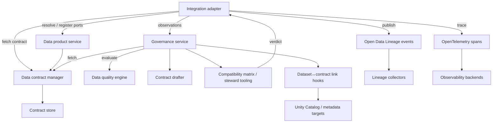

# Integration Layer Component

dc43 keeps governance logic decoupled from runtime execution. The
integration layer provides runtime-specific adapters (Spark, warehouses,
streaming engines, APIs, …) that bridge pipeline runs to the contract
manager and the remote governance coordination service. Integrations do
**not** compute governance outcomes themselves—they validate the data,
collect observations, and delegate the decision to the service before
continuing or blocking the pipeline.

## Responsibilities

1. **Resolve runtime identifiers** (paths, tables, dataset versions) and
   map them to contract ids supplied by the data contract manager.
2. **Register and resolve data product bindings** so ODPS input/output
   ports remain in sync with contract versions exposed by governance
   services.
3. **Validate and coerce data** using the retrieved contract while
   respecting enforcement flags.
4. **Call the governance service** with validation metrics so it can
   consult the contract manager, data-quality engine, and draft tooling.
5. **Surface governance decisions** (status, drafts, recorded
   provenance) back to the runtime so pipelines can block, warn, or
   persist draft proposals alongside the dataset version.
6. **Expose ergonomic APIs** for orchestrators—wrapping multiple
   component calls behind a simple read/write interface.
7. **Publish observability signals** by emitting Open Data Lineage
   events or OpenTelemetry spans when the configured publication mode
   requests them.

Adapters should stay thin: they orchestrate the component interfaces
rather than re-implementing them. Implementations can target Spark, SQL
warehouses, streaming frameworks, REST services, or ELT tools.

## Data product bindings and draft enforcement

Spark pipelines can now declare Open Data Product Standard (ODPS) bindings when
calling the integration helpers. Governance-first wrappers surface the most
common flows:

- `read_with_governance` / `write_with_governance` accept
  `GovernanceSparkReadRequest`/`GovernanceSparkWriteRequest` payloads so callers
  describe the contract or port they want to interact with while keeping Spark
  overrides (format, dataset locator, streaming callbacks) in one place.
- Convenience helpers such as `read_from_contract`, `write_with_contract_id`,
  `read_from_data_product`, and `write_to_data_product` now build those
  governance requests under the hood. They are **deprecated** and continue to
  exist solely for incremental migrations—new pipelines should rely on the
  governance-first helpers directly.

Batch pipelines typically call into the governance-only wrappers while streaming jobs reuse
`read_stream_with_governance` / `write_stream_with_governance`. Callers describe
their intent through `GovernanceSparkReadRequest`/`GovernanceSparkWriteRequest`
objects, which combine the `GovernanceReadContext`/`GovernanceWriteContext`
payloads with Spark-specific overrides (format, dataset locator, streaming
callbacks). Passing both a binding and a contract id continues to pin the run to
the requested contract while recording the port metadata.

Whenever a read or write registers a new input/output port the integration
layer aborts the pipeline: the service returns a draft ODPS document and dc43
raises to guarantee the draft is reviewed before the pipeline is rerun. The
registration payload includes the draft version so orchestration logs can point
data stewards at the exact ODPS revision that needs attention. Pipelines that
should continue must pre-register their ports or run a preparatory job that
creates the draft out-of-band.

The data product backend ships with the in-memory implementation used by tests,
a filesystem-backed variant (`FilesystemDataProductServiceBackend`) that
serialises ODPS documents as JSON compliant with the official schema, and a
Collibra-aware backend (`CollibraDataProductServiceBackend`). The latter pairs
with either `StubCollibraDataProductAdapter`—a filesystem stub suitable for
local development—or `HttpCollibraDataProductAdapter` when pointing at a live
Collibra deployment. This makes it easy to capture the resulting draft
documents alongside contract files in source control or wire the same pipeline
to Collibra without code changes.

> Run `pytest packages/dc43-integrations/tests/test_integration.py -k
> data_product_pipeline_roundtrip -q` to exercise the full
> “data product → intermediate contract → data product” hand-off.

## Publication modes

Integrations honour the governance publication mode so teams can plug dc43 into
their lineage or observability stacks without forking the orchestration code.
The mode can be set via:

- the `publication_mode` field on governance requests and helper functions,
- the `DC43_GOVERNANCE_PUBLICATION_MODE` environment variable, or
- runtime configuration keys such as `dc43.governance.publicationMode`,
  `dc43.governance.publication_mode`, or `governance.publication.mode`.

When `open_data_lineage` is active the adapter serialises governance plans into
Open Data Lineage run events instead of registering governance activities. The
events capture dataset identifiers, ODPS bindings, pipeline context, and
validation results so downstream tooling can rebuild the full read/write graph.

Selecting `open_telemetry` produces OpenTelemetry spans with the same
information. This mode also skips governance activity registration; instead, the
spans contain attributes for contracts, datasets, bindings, pipeline context,
and validation outcomes, plus events detailing expectation plans. Both modes
continue to call the governance service for compatibility decisions so the
integration layer retains enforcement semantics while streaming richer signals
to external systems.

## Implementation catalog

Technology-specific guides live under
[`docs/implementations/integration/`](implementations/integration/):

- [Spark & DLT adapter](implementations/integration/spark-dlt.md)

Document additional adapters (Snowflake, Flink, dbt, …) in the same
folder so engineering teams can adopt the runtime that matches their
platform.
