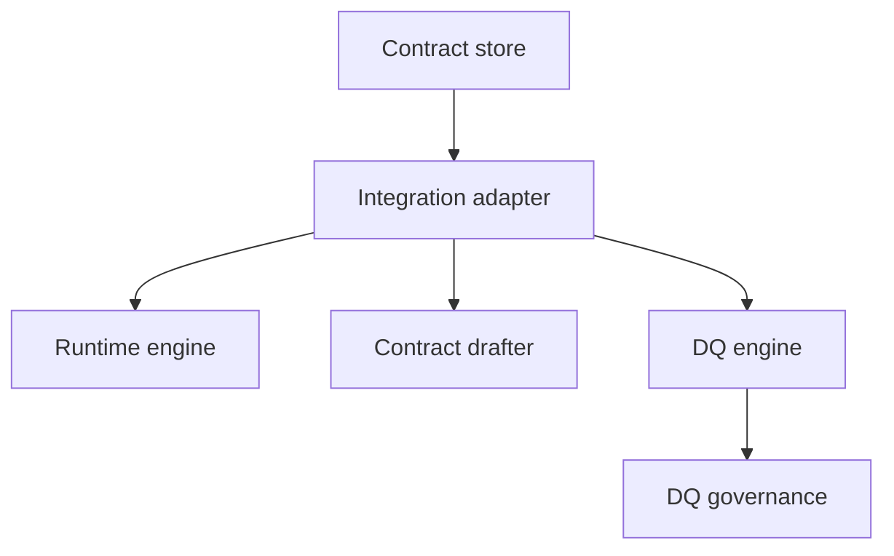

# Integration Layer Component

dc43 keeps governance logic decoupled from runtime execution. The
integration layer provides adapters that apply contracts, call the data
quality engine, and coordinate with platform-specific services (Spark,
warehouses, streaming engines, APIs, …).

## Responsibilities

1. **Resolve runtime identifiers** (paths, tables, dataset versions) and
   map them to contract ids.
2. **Validate and coerce data** while respecting enforcement flags.
3. **Bridge runtime metrics** to the `DQClient` and contract drafter when
   mismatches occur.
4. **Expose ergonomic APIs** for pipelines and orchestration tools.

An adapter should stay thin: it orchestrates the component interfaces
rather than re-implementing them. Implementations can target Spark, SQL
warehouses, streaming frameworks, REST services, or ELT tools.

## Implementation catalog

Technology-specific guides live under
[`docs/implementations/integration/`](implementations/integration/):

- [Spark & DLT adapter](implementations/integration/spark-dlt.md)

Document additional adapters (Snowflake, Flink, dbt, …) in the same
folder so engineering teams can adopt the runtime that matches their
platform.
