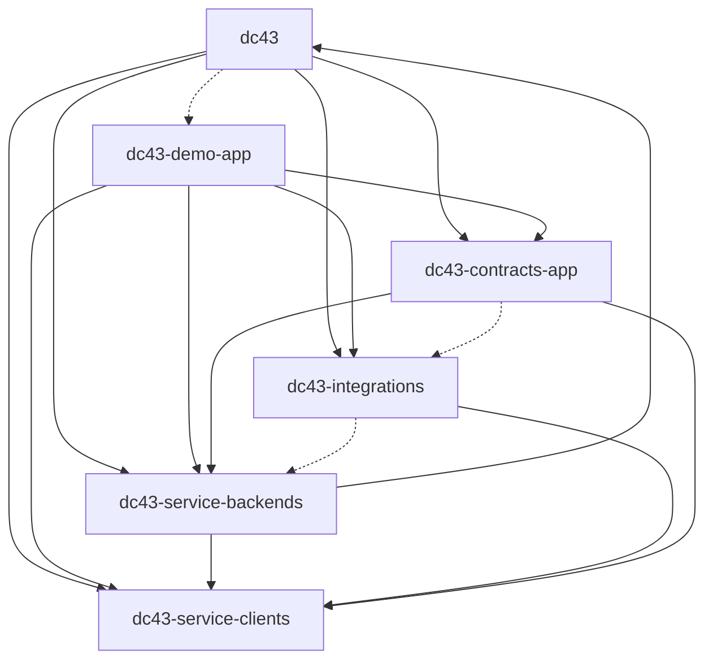

# Internal package dependency graph

The dc43 repository bundles multiple installable distributions that depend on
one another. The diagram below is generated from the package metadata to help
spot cycles and optional extras when adjusting dependencies.

To regenerate the diagram, run:

```bash
python scripts/dependency_graph.py --output docs/component-package-dependencies.mmd
```

and embed the resulting Mermaid snippet into this document.


