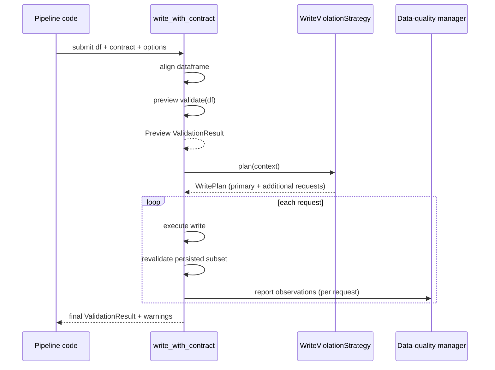

# Write Violation Strategies

Write violation strategies let integration adapters choose how to persist data when a contract validation discovers errors or warnings.
Instead of hard-coding a single behaviour, adapters receive a `WriteViolationStrategy` implementation that can split the input
DataFrame, surface additional datasets, or keep the legacy pass-through behaviour.

The mechanism lives in `dc43.components.integration.violation_strategy` and is consumed by `write_with_contract` in the Spark adapter.
It is runtime-agnostic: other integrations can reuse the protocol to provide the same flexibility in warehouses or streaming engines.

## Why strategies?

Contract enforcement often needs to react differently depending on the downstream consumer and the severity of the issues:

- **Default / no-op** – keep the existing behaviour and write the full dataset even if violations exist.
- **Split datasets** – create "valid" and "reject" derivatives so data stewards can repair the bad portion without blocking the entire
  run. Contracts and governance tools need to register these sibling datasets to ensure they inherit the correct lifecycle.
- **Reject-only** – only persist the rejected rows for triage, avoiding the risk of analysts consuming partially valid data.
- **Custom routing** – send bad records to remediation queues, alerting systems, or quarantine storage while the clean subset flows
  downstream.

By delegating the decision to a strategy object we decouple enforcement policy from the integration code. Pipelines can choose
the right strategy through configuration while reusing the same runtime orchestration and data-quality integration.

## Runtime flow

The Spark adapter exposes `write_with_contract`. It first aligns the dataframe to the contract and runs a **preview validation** to
decide whether enforcement should block the write and to give strategies enough context to plan additional actions. Once the plan is
ready the adapter executes the writes and immediately revalidates each persisted subset so that metrics and schema snapshots reflect
the immutable dataset version produced by the run.

The strategy controls which write requests run:

- `primary` mirrors the behaviour prior to strategies (single write). It can be omitted when the strategy wants to fully replace the output.
- `additional` contains secondary writes such as the `valid` and `reject` datasets.
- Each `WriteRequest` carries the dataframe subset, runtime options, and—after execution—the `ValidationResult` for that subset.

The adapter executes the primary request first (if present) and then processes additional requests while reporting observations back
through the data-quality manager. Revalidation happens after each write to guarantee that the recorded metrics and warnings refer to
the persisted snapshot rather than an in-memory dataframe that could still change before storage.

## Strategy building blocks

Strategies receive a `WriteStrategyContext` with the aligned dataframe, validation verdict, contract metadata, and helpers to
re-run validation on derived subsets. From this context they can:

- Inspect whether the initial validation recorded violations.
- Compute Spark filters using expectation predicates gathered from the contract.
- Derive new dataset identifiers (`dataset_id::suffix`) and storage paths.
- Re-validate each subset via `context.revalidate` to capture row counts and violation metrics for downstream governance.

`WritePlan` returns the primary write request, a collection of additional requests, and an optional factory that lets the strategy
override the final validation result after the adapter has revalidated the persisted outputs (e.g., valid/reject only).

## Built-in strategies

`dc43` ships two reference implementations:

- `NoOpWriteViolationStrategy` – preserves legacy behaviour. All rows are written once and the original validation result is returned.
- `SplitWriteViolationStrategy` – filters aligned rows using the combined expectation predicates and writes the `valid` and
  `reject` subsets. Behaviour flags allow omitting either subset, keeping the primary write even when violations exist, or customising
  naming (`valid_suffix`, `reject_suffix`, separator).

The split strategy also enriches the validation warnings so pipelines reading the original dataset learn about the available
subsets. This enables downstream consumers to opt into the "valid" derivative when they can tolerate partial availability.

## Registering derivative datasets

When a strategy introduces new datasets (`dataset_id::valid`, `dataset_id::reject`) the integration layer should:

1. **Create contract bindings** – extend the contract definitions or governance metadata so the suffix datasets point to the same
   schema and quality expectations as the primary dataset.
2. **Notify the data-quality manager** – each write request submits observations so the governance tool can evaluate the subsets
   independently and track their compatibility state.
3. **Surface runtime status** – propagate warnings or telemetry to orchestration systems (e.g., Databricks jobs, Airflow) so operators
   know when a run produced derivative datasets.

Following these steps keeps governance tooling aware of the new dataset lifecycle while providing analysts with trusted split outputs.

## Extending the catalogue

Custom strategies can subclass `WriteViolationStrategy` and register them in orchestration configuration. Typical extensions include:

- Persisting rejects to message queues or ticketing systems.
- Creating remediation notebooks that trigger automatically when rejects appear.
- Implementing SLA-specific logic (e.g., treat schema drift separately from record-level violations).

Because strategies operate purely on the context, they remain testable units that do not depend on Spark internals. Unit tests can
mock the dataframe API and verify that the plan contains the expected requests.

