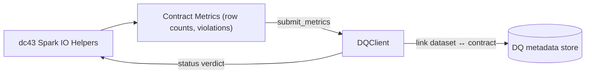

# Data Quality Component Responsibilities & Integration Options

The dc43 runtime can notify an external data-quality (DQ) or data-observability (DO) service about contract checks and consume
its verdicts before serving data. This document explains the contract-facing responsibilities of that component and outlines
implementation choices ranging from the bundled filesystem stub to production-grade monitoring platforms.

## What the DQ Component Does

A DQ client acts as the control plane for schema enforcement outcomes. At minimum it must be able to:

1. **Track dataset ↔ contract links** so downstream readers know which specification governs a dataset version.
2. **Return a status** (`ok`, `warn`, `block`, or `unknown`) indicating whether the dataset version satisfies the contract.
3. **Receive metrics** (e.g., row counts, expectation violations) emitted by Spark or DLT so it can compute the status.

dc43 interacts with the component through the `DQClient` protocol (`src/dc43/dq/base.py`):

```python
from dc43.dq.base import DQClient, DQStatus

class MyDQClient(DQClient):
    def get_status(self, *, contract_id, contract_version, dataset_id, dataset_version) -> DQStatus:
        ...

    def submit_metrics(self, *, contract, dataset_id, dataset_version, metrics) -> DQStatus:
        ...

    def link_dataset_contract(self, *, dataset_id, dataset_version, contract_id, contract_version) -> None:
        ...

    def get_linked_contract_version(self, *, dataset_id) -> str | None:
        ...
```

A client can be wired into `read_with_contract` and `write_with_contract` so enforcement paths look like:



## Available Implementations

| Option | When to Use | Notes |
| --- | --- | --- |
| [`StubDQClient`](../src/dc43/dq/stub.py) | Local development, demos, CI | Stores statuses and links on the filesystem. Implements naive violation counting and can block or warn on mismatches. |
| Spark metrics sink + custom adapter | Teams with in-house observability platforms (e.g., Datadog, Prometheus) | Build a thin client that forwards metrics to the existing platform, computes pass/fail thresholds, and persists verdicts for `get_status`. |
| Delta Live Tables expectations | Pipelines already using DLT expectations and event logs | Parse `event_log` expectation metrics, submit them through a client, and push verdicts back into Collibra, a Delta table, or another catalog. DLT exposes violations via the `flow_progress` events.|
| [Great Expectations](https://greatexpectations.io/) or similar rule engines | Need declarative, reusable expectations with dashboards | Wrap GX validation results in the `DQStatus` schema. Store run metadata (checkpoint, batch identifiers) in the DQ system so dc43 can retrieve them. |
| Collibra quality workflows | Organizations standardizing on Collibra | Reuse Collibra workflows to persist validation outcomes. Combine with the Collibra contract gateway so stewardship sees contract state and quality feedback in one place. |

## Designing a Production DQ Adapter

When implementing a new client, keep the following in mind:

* **Idempotency**: `submit_metrics` may be called multiple times for the same dataset version. Make sure updates overwrite prior status instead of duplicating entries.
* **Metric mapping**: dc43 forwards raw metrics as a dictionary. Establish a convention (e.g., `violations.expectation_name`) so the adapter can distinguish blocking and warning rules.
* **Access control**: Dataset identifiers often map to storage paths or table names. Store secrets (API keys, tokens) in Databricks secrets or another vault.
* **Asynchronous workflows**: `get_status` can return `unknown` while downstream validation jobs run. Callers can retry or poll before promoting data.

## References

* Delta Live Tables expectations and event log: <https://docs.databricks.com/en/delta-live-tables/expectations.html>
* Databricks quality & observability patterns: <https://docs.databricks.com/en/delta-live-tables/observability.html>
* Great Expectations architecture: <https://docs.greatexpectations.io/docs/>
* Collibra Data Products — Data Contracts: <https://productresources.collibra.com/docs/collibra/latest/Content/Assets/DataProducts/co_data-product.htm>
