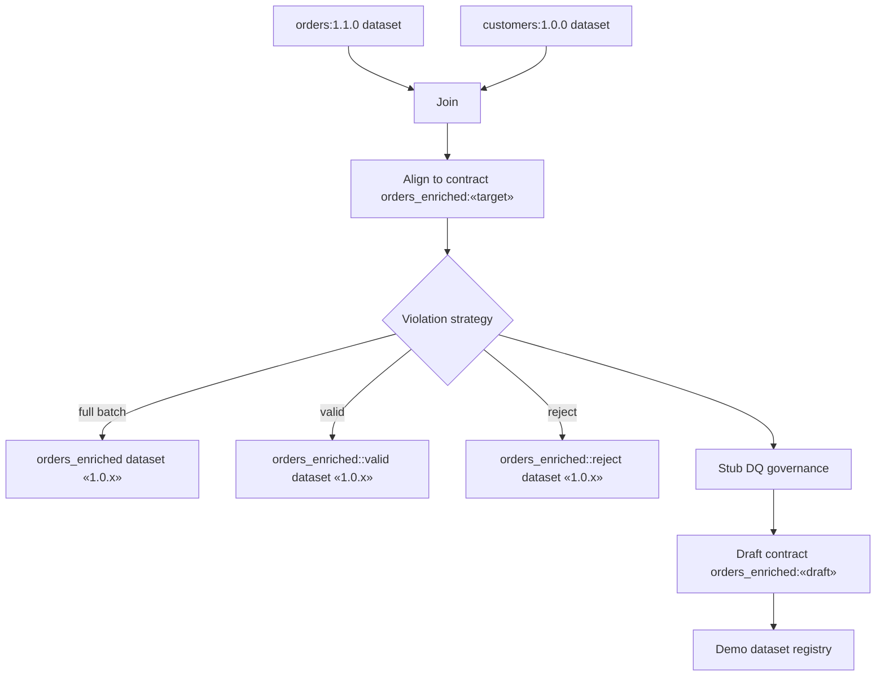

# Demo pipeline scenarios

The demo application exposes a handful of pre-baked Spark pipeline runs to highlight how dc43 components interact. This guide summarises what each scenario exercises and how the new write-violation strategies route data when quality checks fail.

## Runtime building blocks

Each scenario executes the same high-level flow:



*The placeholder «target» represents the enforced contract version for the scenario,
and «draft» illustrates the optional draft recorded when violations exist. All
written datasets use the same auto-incrementing semantic version (for example
`1.0.0` on the first run, `1.0.1` on the second, and so on).* 

* **Orders** and **Customers** are validated against their contracts on read.
* The joined dataframe is aligned to the target contract before writing.
* The **violation strategy** decides how to persist results when validation raises warnings or failed expectations.
* Strategies may keep the contracted dataset even when violations exist so that consumers can audit the full batch alongside any derived splits.
* Governance replays the validation outcome, submits metrics, and records draft contracts when necessary.

## Scenario catalogue

| Scenario | Strategy | Target contract | Draft contract | Datasets written |
| --- | --- | --- | --- | --- |
| **No contract provided** | No-op (default) | *(none)* | *(none)* | Write blocked; planned `result-no-existing-contract:1.0.0` is never created. |
| **Existing contract OK** | No-op (default) | `orders_enriched:1.0.0` | *(none)* | `orders_enriched:1.0.x` (full batch). |
| **Existing contract fails DQ** | No-op (default) | `orders_enriched:1.1.0` | `orders_enriched:1.2.0` | Write blocked; no dataset versions materialised. |
| **Contract fails schema and DQ** | No-op (default) | `orders_enriched:2.0.0` | `orders_enriched:2.1.0` | Write blocked; no dataset versions materialised. |
| **Blocked partial input** | No-op (default) | `orders_enriched:1.1.0` | *(none)* | Read aborts because governance marks `orders:partial-batch` as `block`. |
| **Prefer valid subset** | No-op (default) | `orders_enriched:1.1.0` | *(none)* | Uses `orders::valid:partial-batch`; writes `orders_enriched:1.0.x`. |
| **Override with full batch** | No-op (default) with read override | `orders_enriched:1.1.0` | `orders_enriched:1.2.0` | Forced read of `orders:partial-batch` continues; downstream validation records violations. |
| **Split invalid rows** | `SplitWriteViolationStrategy` | `orders_enriched:1.1.0` | `orders_enriched:1.2.0` | `orders_enriched:1.0.x`, `orders_enriched::valid:1.0.x`, `orders_enriched::reject:1.0.x`. |

### Scenario breakdown

All dataset versions default to `1.0.0` the first time a scenario writes a given dataset and automatically increment the patch segment (`1.0.1`, `1.0.2`, …) on subsequent runs. When a run is blocked the planned version is skipped because nothing is persisted.

#### No contract provided
- **Target contract:** *(none)* — the planner cannot lock in a dataset version without a contract.
- **Dataset versions:** Planned `result-no-existing-contract:1.0.0` is abandoned; no draft exists.
- **Outcome:** Enforcement stops immediately with an error.

#### Existing contract OK
- **Target contract:** `orders_enriched:1.0.0` with no draft changes.
- **Dataset versions:** Writes `orders_enriched:1.0.0` on the first run and bumps the patch version (`1.0.1`, `1.0.2`, …) on later executions.
- **Outcome:** Post-write validation succeeds and the run records OK.

#### Existing contract fails DQ
- **Target contract:** `orders_enriched:1.1.0` while draft `orders_enriched:1.2.0` captures failed expectations.
- **Dataset versions:** None; the split is planned but blocked after validation detects violations.
- **Outcome:** Enforcement errors, signalling downstream flows to halt.

#### Contract fails schema and DQ
- **Target contract:** `orders_enriched:2.0.0` with proposed draft `orders_enriched:2.1.0`.
- **Dataset versions:** None; schema alignment fails before persistence.
- **Outcome:** Enforcement errors and flags the draft for review.

#### Blocked partial input
- **Target contract:** `orders_enriched:1.1.0` but the run never reaches the write step.
- **Dataset versions:** None; `read_with_contract` raises when the stored DQ status for `orders:partial-batch` is `block`.
- **Outcome:** Demonstrates how strict enforcement prevents downstream consumers from ingesting a partially valid submission.

#### Prefer valid subset
- **Target contract:** `orders_enriched:1.1.0` using the curated `orders::valid:partial-batch` slice.
- **Dataset versions:** `orders_enriched:1.0.x` is written because every surviving record still satisfies the `amount > 100` expectation after transformation.
- **Outcome:** Read validation succeeds; the registry records an OK run and surfaces the smaller input metrics (two rows instead of three).

#### Override with full batch
- **Target contract:** `orders_enriched:1.1.0` while governance continues to flag the original dataset as invalid.
- **Dataset versions:** `orders_enriched:1.0.x` is persisted alongside a draft `orders_enriched:1.2.0` describing violations.
- **Outcome:** A custom read-status override downgrades the `block` verdict to `warn`, allowing the run to proceed so observers can inspect the downstream blast radius.

#### Split invalid rows
- **Target contract:** `orders_enriched:1.1.0` with draft `orders_enriched:1.2.0` containing reject samples.
- **Dataset versions:** Persists `orders_enriched`, `orders_enriched::valid`, and `orders_enriched::reject` with the same incremented version identifier (for example `1.0.0`).
- **Outcome:** Run completes with a warning; auxiliary datasets expose valid/reject partitions.

## Split strategy walkthrough

The split scenario executes with the following configuration:

```python
{
    "name": "split",
    "include_valid": True,
    "include_reject": True,
    "write_primary_on_violation": True,
}
```

Key outcomes:

* When the quality rule `amount > 100` fails, the contracted dataset is written alongside two auxiliary datasets:
  * `orders_enriched` still reflects the full batch—including the rejected rows—so auditors can reconcile the original submission. The demo flags this in the registry with a warning badge.
  * `orders_enriched::valid` contains all rows that passed every expectation.
  * `orders_enriched::reject` captures rows that violated at least one expectation so data stewards can remediate them.
  * The demo boosts one sample order above the threshold so the valid subset always includes illustrative data.
* The validation warnings bubble up in the registry UI so readers know that auxiliary datasets exist.
* Data-quality governance evaluates each split write, persisting metrics and draft contracts per dataset so change management stays intact. The registry now records the highest violation count across every output so the summary table reflects the number of affected rows.

Want the split run to fail outright? Switch the strategy to `split-strict` which wraps the split planner with `StrictWriteViolationStrategy`. The valid/reject datasets are still written but the returned validation result has `ok=False`, causing the demo to log the run as an error.

Use this scenario as a template to plug custom strategies into your own pipelines—swap out suffixes, toggle the primary write, or specialise behaviour by subclassing `WriteViolationStrategy`.
