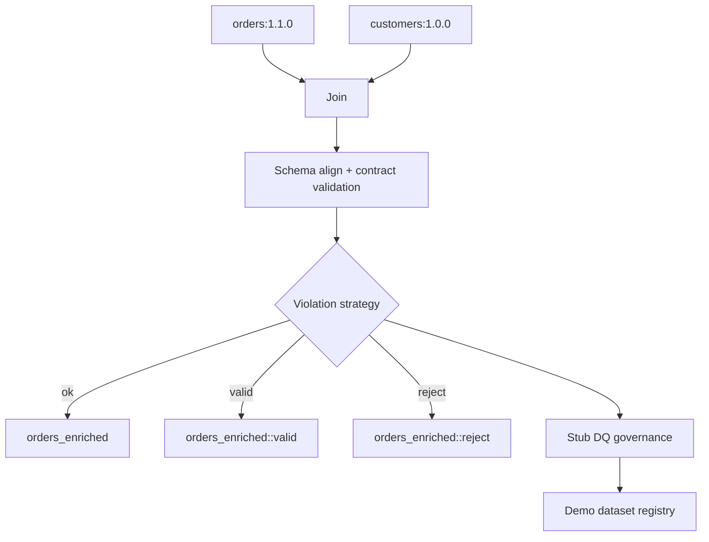

# Demo pipeline scenarios

The demo application exposes a handful of pre-baked Spark pipeline runs to highlight how dc43 components interact. This guide summarises what each scenario exercises and how the new write-violation strategies route data when quality checks fail.

## Runtime building blocks

Each scenario executes the same high-level flow:



* **Orders** and **Customers** are validated against their contracts on read.
* The joined dataframe is aligned to the target contract before writing.
* The **violation strategy** decides how to persist results when validation raises warnings or failed expectations.
* Governance replays the validation outcome, submits metrics, and records draft contracts when necessary.

## Scenario catalogue

| Scenario | What it shows | Strategy |
| --- | --- | --- |
| **No contract provided** | How schema validation behaves when no output contract is supplied. The run fails because `run_type=enforce` forbids writing without a contract. | No-op (default) |
| **Existing contract OK** | Baseline happy path using `orders_enriched:1.0.0`. | No-op (default) |
| **Existing contract fails DQ** | Data quality failures (amount ≤ 100) block the run, including captured expectation examples. | No-op (default) |
| **Contract fails schema and DQ** | Simultaneous schema drift and expectation failures prompting a draft contract. | No-op (default) |
| **Split invalid rows** | Routes valid and invalid subsets to dedicated datasets so downstream consumers can pick the slice they need. | `SplitWriteViolationStrategy` |

## Split strategy walkthrough

The split scenario executes with the following configuration:

```python
{
    "name": "split",
    "include_valid": True,
    "include_reject": True,
    "write_primary_on_violation": False,
}
```

Key outcomes:

* When the quality rule `amount > 100` fails, the primary dataset is skipped and two new datasets are materialised:
  * `orders_enriched::valid` contains all rows that passed every expectation.
  * `orders_enriched::reject` captures rows that violated at least one expectation so data stewards can remediate them.
  * The demo boosts one sample order above the threshold so the valid subset always includes illustrative data.
* The validation warnings bubble up in the registry UI so readers know that auxiliary datasets exist.
* Data-quality governance evaluates each split write, persisting metrics and draft contracts per dataset so change management stays intact.

Use this scenario as a template to plug custom strategies into your own pipelines—swap out suffixes, toggle the primary write, or specialise behaviour by subclassing `WriteViolationStrategy`.
