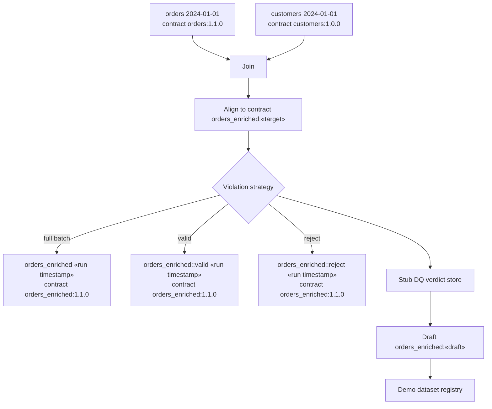

# Demo pipeline scenarios

The demo application exposes a handful of pre-baked Spark pipeline runs to highlight how dc43 components interact. This guide summarises what each scenario exercises and how the new write-violation strategies route data when quality checks fail.

## Runtime building blocks

Each scenario executes the same high-level flow with the filesystem-backed
stub governance client standing in for a catalog. The "Governance" step shown
in the diagrams refers to the `StubDQClient` that accompanies the demo: it
stores the verdicts returned by read and write validation, captures the
metrics produced by the quality rules, and records draft contract versions so
the UI mirrors what a catalog-integrated deployment would display.



*The placeholder «target» represents the enforced contract version for the scenario,
and «draft» illustrates the optional draft recorded when violations exist. The demo
records every write with an ISO-8601 timestamp (for example `2025-09-28T19:05:42Z`),
so retries never collide with previous runs. The default `orders` input references
the curated `2024-01-01` slice; scenarios that demonstrate partial-batch governance
override the locator to the `2025-09-28` submission, including its curated
`orders::valid` and `orders::reject` siblings.*

* **Orders** and **Customers** are validated against their contracts on read.
* The joined dataframe is aligned to the target contract before writing.
* The **violation strategy** decides how to persist results when validation raises warnings or failed expectations.
* Strategies may keep the contracted dataset even when violations exist so that consumers can audit the full batch alongside any derived splits.
* The stub governance client (`StubDQClient`) replays the validation outcome, persists metrics, and emits verdicts/draft versions exactly as a catalog-backed data-quality service would.

## Scenario catalogue

| Scenario | Strategy | Target contract | Draft contract | Datasets written |
| --- | --- | --- | --- | --- |
| **No contract provided** | No-op (default) | *(none)* | *(none)* | Write blocked; the planned dataset is never created. |
| **Existing contract OK** | No-op (default) | `orders_enriched:1.0.0` | *(none)* | `orders_enriched` persisted with the run timestamp. |
| **Existing contract fails DQ** | No-op (default) | `orders_enriched:1.1.0` | `orders_enriched:1.2.0` | `orders_enriched` is persisted with the run timestamp before governance returns a `block` verdict and a draft. |
| **Contract fails schema and DQ** | No-op (default) | `orders_enriched:2.0.0` | `orders_enriched:2.1.0` | `orders_enriched` is written with the run timestamp, but schema drift and DQ failures downgrade the run to `block`. |
| **Invalid input blocked** | No-op (default) | `orders_enriched:1.1.0` | *(none)* | Read aborts because governance marks `orders:2025-09-28` as `block` while pointing to the curated valid/reject slices. |
| **Prefer valid subset** | No-op (default) | `orders_enriched:1.1.0` | *(none)* | Reads `orders::valid:2025-09-28` and writes `orders_enriched` with the run timestamp under contract `1.1.0`. |
| **Valid subset, invalid output** | No-op (default) | `orders_enriched:1.1.0` | `orders_enriched:1.2.0` | Starts from `orders::valid:2025-09-28`, but the join lowers a value so `orders_enriched` (timestamped) is stored with `block` status and a draft. |
| **Override block with full batch** | No-op (default) with read override | `orders_enriched:1.1.0` | `orders_enriched:1.2.0` | Downgrades the `orders:2025-09-28` verdict to `warn`, writes `orders_enriched` with the run timestamp, and logs the manual override plus reject metrics. |
| **Split invalid rows** | `SplitWriteViolationStrategy` | `orders_enriched:1.1.0` | `orders_enriched:1.2.0` | `orders_enriched`, `orders_enriched::valid`, and `orders_enriched::reject` share the same timestamped version. |

### Scenario breakdown

All dataset versions default to an ISO-8601 timestamp captured at write time. When a run is blocked the planned version is skipped because nothing is persisted, leaving the previous timestamped run untouched.

#### No contract provided
- **Target contract:** *(none)* — the planner cannot lock in a dataset version without a contract.
- **Dataset versions:** Planned dataset is abandoned; no draft exists.
- **Outcome:** Enforcement stops immediately with an error.

#### Existing contract OK
- **Target contract:** `orders_enriched:1.0.0` with no draft changes.
- **Dataset versions:** Writes `orders_enriched` once per run using the run timestamp as the dataset version.
- **Outcome:** Post-write validation succeeds and the run records OK.

#### Existing contract fails DQ
- **Target contract:** `orders_enriched:1.1.0` while draft `orders_enriched:1.2.0` captures failed expectations.
- **Dataset versions:** `orders_enriched` is created with the run timestamp before governance flips the outcome to `block` and records the draft.
- **Outcome:** Enforcement errors, signalling downstream flows to halt while the persisted dataset remains quarantined under a `block` verdict.

#### Contract fails schema and DQ
- **Target contract:** `orders_enriched:2.0.0` with proposed draft `orders_enriched:2.1.0`.
- **Dataset versions:** `orders_enriched` is written with the run timestamp, but downstream schema validation and DQ checks respond with a `block` verdict.
- **Outcome:** Enforcement errors and flags the draft for review while the run history shows the blocked write.

#### Invalid input blocked
- **Target contract:** `orders_enriched:1.1.0`, but strict enforcement stops at the read stage.
- **Dataset versions:** None; `read_with_contract` raises because governance records `orders:2025-09-28` as `block`.
- **Outcome:** Highlights the default behaviour when mixed-validity inputs arrive. The stub governance entry also references `orders::valid:2025-09-28` and `orders::reject:2025-09-28` so downstream jobs know where to look for remediated slices.

#### Prefer valid subset
- **Target contract:** `orders_enriched:1.1.0` using the curated `orders::valid:2025-09-28` slice alongside `customers:2024-01-01`.
- **Dataset versions:** `orders_enriched` is written with the run timestamp because every surviving record still satisfies the `amount > 100` expectation after transformation.
- **Outcome:** Read validation succeeds; the registry records an OK run and surfaces the smaller input metrics (two rows instead of three).

#### Valid subset, invalid output
- **Target contract:** `orders_enriched:1.1.0`, still reading `orders::valid:2025-09-28`.
- **Dataset versions:** `orders_enriched` (timestamped) is persisted but tagged with draft `orders_enriched:1.2.0` because the demo deliberately lowers a value below the threshold.
- **Outcome:** Shows that clean inputs do not guarantee compliant outputs—the enforcement mode raises after the stub governance service returns a `block` verdict.

#### Override block with full batch
- **Target contract:** `orders_enriched:1.1.0` while governance continues to flag the original dataset as invalid.
- **Dataset versions:** `orders_enriched` (timestamped) is persisted alongside a draft `orders_enriched:1.2.0` describing violations and carrying the manual override note.
- **Override:** The `allow-block` read strategy downgrades the verdict to `warn` and appends the "accepted 2025-09-28 batch" note so the run history reflects manual intervention.
- **Outcome:** A custom read-status strategy downgrades the `block` verdict to `warn`, allowing the run to proceed so observers can inspect the downstream blast radius while the registry highlights the override note, the downgrade, and the reject-row metrics.

#### Split invalid rows
- **Target contract:** `orders_enriched:1.1.0` with draft `orders_enriched:1.2.0` containing reject samples.
- **Dataset versions:** Persists `orders_enriched`, `orders_enriched::valid`, and `orders_enriched::reject` with the same run timestamp so the trio can be correlated.
- **Outcome:** Run completes with a warning; auxiliary datasets expose valid/reject partitions.

## Split strategy walkthrough

The split scenario executes with the following configuration:

```python
{
    "name": "split",
    "include_valid": True,
    "include_reject": True,
    "write_primary_on_violation": True,
}
```

Key outcomes:

* When the quality rule `amount > 100` fails, the contracted dataset is written alongside two auxiliary datasets:
  * `orders_enriched` still reflects the full batch—including the rejected rows—so auditors can reconcile the original submission. The demo flags this in the registry with a warning badge.
  * `orders_enriched::valid` contains all rows that passed every expectation.
  * `orders_enriched::reject` captures rows that violated at least one expectation so data stewards can remediate them.
  * The demo boosts one sample order above the threshold so the valid subset always includes illustrative data.
* The validation warnings bubble up in the registry UI so readers know that auxiliary datasets exist.
* Data-quality governance evaluates each split write, persisting metrics and draft contracts per dataset so change management stays intact. The registry now records the highest violation count across every output so the summary table reflects the number of affected rows.

Want the split run to fail outright? Switch the strategy to `split-strict` which wraps the split planner with `StrictWriteViolationStrategy`. The valid/reject datasets are still written but the returned validation result has `ok=False`, causing the demo to log the run as an error.

Use this scenario as a template to plug custom strategies into your own pipelines—swap out suffixes, toggle the primary write, or specialise behaviour by subclassing `WriteViolationStrategy`.
