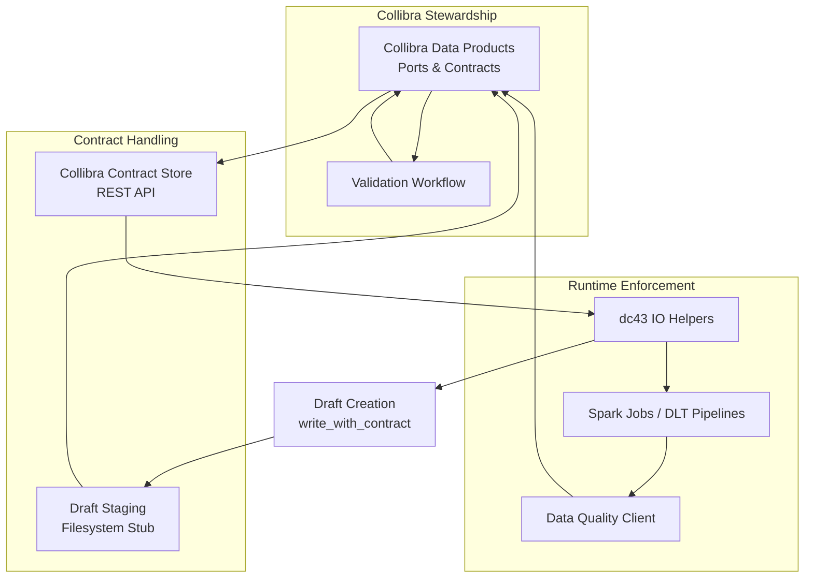

# Collibra-Orchestrated Data Contract Lifecycle

This document outlines how dc43 can integrate with [Collibra Data Products](https://productresources.collibra.com/docs/collibra/latest/Content/Assets/DataProducts/co_data-product.htm) to manage the lifecycle of data contracts alongside datasets and pipelines. Collibra can simultaneously fulfil the **contract manager**, **data-quality governance interface**, and steward workflow requirements described in the main architecture while remaining the system of record for the compatibility matrix. Pair this guide with the [Collibra contract store reference](../contract-store/collibra.md) for low-level API mappings.

## Goals

* Centralize contract ownership and approval inside Collibra while dc43 continues to enforce the resulting specifications in Spark and Delta Live Tables (DLT).
* Re-use Collibra's native notions of **Data Products**, **Ports**, and **Contracts** to model the same artefacts surfaced by dc43.
* Allow pipelines to react automatically when Collibra validates a contract (for example by re-running a pipeline to fix or update datasets) and synchronize quality verdicts back to stewards.

## Conceptual Mapping

Collibra exposes "Data Contracts" as first-class objects attached to Data Product ports. They already include status management (draft, validated, deprecated, ...). dc43 models data contracts using the Bitol/ODCS schema. The two can be mapped as follows:

| dc43 artefact | Collibra object | Notes |
| --- | --- | --- |
| Contract ID (`sales.orders`) | Data Product Port (e.g. `orders-gold`) | The port groups datasets that share the same contract. |
| Contract version (`1.2.0`) | Data Contract version on the port | Versions are tracked in Collibra and surfaced via the API. |
| Draft contract (ODCS JSON) | Collibra contract in `Draft` status | Drafts originate from dc43 `write_with_contract(..., draft_on_mismatch=True)` workflows. |
| Validation status | Collibra contract workflow state (`Validated`, `Rejected`, ...) | Collibra becomes the source of truth. |
| Dataset version status | Collibra Data Product status or custom attribute | Optionally updated when the contract is promoted. |

## Component Touchpoints

| dc43 component | Collibra capability | Notes |
| --- | --- | --- |
| Contract manager/store | Data Product contract APIs | `CollibraContractStore` delegates to the REST endpoints exposed for ports and versions. |
| Contract drafter | Workflow-driven drafts | `write_with_contract` can call `CollibraContractGateway.submit_draft` instead of persisting to a filesystem bucket. |
| Data quality governance | Workflow states & custom attributes | Collibra workflows and attributes store dataset ↔ contract compatibility, including the latest metrics digest and steward verdict. |
| Data quality engine | External metrics sink | Use the metrics emitted by `dc43.dq.engine.spark` (or other engines) to update Collibra status via the gateway; Collibra persists the verdict. |
| Integration layer | Stewardship triggers | Collibra webhooks or scheduled polls notify pipelines to re-run when a contract is validated. |

## Architecture Variant: Collibra-Governed Contracts



This variation extends the generic architecture with Collibra as the system of record for contract status, while dc43's IO helpers and draft workflows continue to enforce and evolve schemas. Drafts may flow through a filesystem-backed stub during testing, but production usage delegates to Collibra's REST APIs for validation and promotion.

## Interaction Flow

1. **Draft proposal**: dc43 detects a schema mismatch while writing and produces an ODCS draft. Instead of storing it in the file-based draft store, it invokes a Collibra client that registers or updates the draft contract on the appropriate port.
2. **Collibra review**: Data Stewards review the draft contract and run their validation workflow inside Collibra. They can enrich the metadata (owners, SLAs, linked policies) before marking it as `Validated`.
3. **Pipeline trigger**: A Collibra webhook or scheduled poll notifies dc43 that the contract has been validated. dc43 resolves the latest validated contract and re-runs the associated pipeline (e.g. via Databricks Jobs or DLT expectations) to enforce the new schema and update datasets.
4. **Continuous checks**: Downstream reads call `read_with_contract` with a Collibra-backed resolver to ensure consumers always use a validated version. Data quality hooks (DQ client) persist metric payloads and statuses back into Collibra so stewards retain the compatibility matrix history.

## Data-quality orchestration

Collibra acts as the system of record for approvals but still relies on external
engines (Soda, Great Expectations, Databricks DLT, dc43's Spark engine, …) to
evaluate rules. Feed those metrics into the Collibra gateway to transition
workflow states and update compatibility matrices. In many deployments the heavy
lifting happens in a specialised observability tool while Collibra stores the
resulting verdicts, triggers steward tasks, and notifies pipelines when
remediation is complete. Collibra is therefore responsible for:

1. Persisting each dataset↔contract pairing as a Collibra relation or custom
   asset with the latest metrics digest.
2. Running or coordinating the steward workflow that evaluates the metrics and
   approves or blocks the dataset version.
3. Exposing APIs (polling or webhooks) so dc43's `DQClient` can request the
   current verdict before serving data.

## Compatibility matrix modelling

Represent the compatibility matrix explicitly in Collibra so stewards and
pipelines share the same truth:

* **Asset design** – create a custom asset type such as `Dataset Contract
  Evaluation` linked to the Data Product port (dataset) and the Collibra contract
  version. Store attributes like dataset version identifier, last metric
  snapshot, steward owner, and expiry.
* **Status fields** – reuse Collibra workflow states (`Draft`, `In Review`,
  `Validated`, `Blocked`) or custom enumerations to mirror dc43's `DQStatus`
  values. The dc43 adapter should map `ok/warn/block/unknown` to the same state
  machine.
* **Metric storage** – persist the raw metrics JSON or an aggregated digest so
  stewards can inspect failure counts. For large payloads, upload documents to a
  Collibra attachment and store the link.
* **Audit trail** – enable workflow history and comments to document why a
  dataset version was approved or rejected. dc43 can surface this context back
  to pipelines via the `details` field on `DQStatus`.

Document the asset identifiers and state mappings in your Collibra gateway
configuration so new datasets automatically follow the same conventions.

## Implementation Strategy

### API Client

* **Preferred**: Implement a Collibra client that wraps their REST APIs for Data Products and Contracts. It should support authentication, search (find the correct Data Product port for a dataset), create/update contract drafts, and fetch the latest validated contract. dc43 ships with `HttpCollibraContractGateway`, which targets the endpoints documented in the Collibra Data Products API (for example `GET /rest/2.0/dataproducts/{dataProductId}/ports/{portId}/contracts` for listing versions and `PUT /rest/2.0/dataproducts/{dataProductId}/ports/{portId}/contracts/{version}` for upserts). Provide a mapping of contract identifiers to `{data_product, port}` pairs and optional access tokens.
* **Fallback / Testing**: Provide a stub reusing the filesystem contract store so no extra persistence layer is required. dc43 includes `StubCollibraContractGateway`, which stores ODCS payloads on disk through `FSContractStore` while keeping Collibra-specific metadata (status, timestamps) in memory for tests and local development.

Both clients should expose a small interface consumed by dc43 components:

```python
from dc43.integration.collibra import HttpCollibraContractGateway, StubCollibraContractGateway
from dc43.storage.collibra import CollibraContractStore

gateway = HttpCollibraContractGateway(
    base_url="https://collibra/api",
    token="...",  # optional bearer token
    contract_catalog={"sales.orders": ("orders-product", "gold-port")},
)
store = CollibraContractStore(gateway, default_status="Draft", status_filter="Validated")

# Use the store anywhere dc43 expects a ContractStore implementation
contract = store.latest("sales.orders")
```

### Integration Points in dc43

* **Contract resolution**: Add a `CollibraContractStore` implementing the existing store interface (`get`, `latest`, `put`, ...), delegating to the Collibra gateway. `latest(..., status="Validated")` filters by Collibra workflow state so runtimes only consume approved versions.
* **Draft creation**: Extend `write_with_contract`'s draft hook to call `submit_draft`. The stub store remains available for environments without Collibra.
* **Pipeline orchestration**: Introduce a lightweight service (e.g. an Airflow DAG or Databricks Job) that subscribes to Collibra webhooks. When a contract transitions to `Validated`, it triggers the downstream pipeline and records dataset remediation status back into Collibra via `update_status`.
* **DQ feedback loop**: Integrate the `dq_client` so metric submissions create or update the compatibility asset, store failure summaries, and transition workflow states. This keeps the Collibra matrix authoritative.

## Operational Considerations

* **Authentication**: Collibra Cloud exposes OAuth 2.0 / personal access tokens. The integration should support secure storage (e.g. Databricks secrets) and token rotation.
* **Idempotency**: Draft submissions may occur multiple times while a pipeline evolves. Implement upsert semantics instead of blindly creating duplicates.
* **Error handling**: Failures in Collibra calls should not crash core Spark jobs. Surface warnings, log telemetry, and fall back to local enforcement where reasonable.
* **Testing**: Use the stub gateway in unit tests with fixtures mirroring Collibra payloads. Contract-parsing logic remains unchanged thanks to the shared ODCS models.

## References

* Collibra Data Products — Data Contracts: <https://productresources.collibra.com/docs/collibra/latest/Content/Assets/DataProducts/co_data-product.htm>
* Open Data Contract Standard (ODCS) 3.0.2 (used by dc43): <https://opendatacontract.org/>
