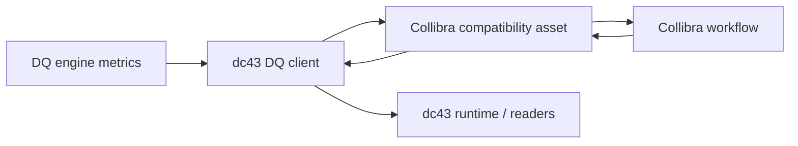

# Collibra Data-Quality Governance Adapter

This guide explains how to wire dc43's data-quality (`DQClient`) interface to
[Collibra Data Products](https://productresources.collibra.com/docs/collibra/latest/Content/Assets/DataProducts/co_data-product.htm)
so Collibra becomes the system of record for dataset↔contract compatibility.
It focuses exclusively on quality orchestration—contract storage and draft
workflows live in the [Collibra contract store reference](../contract-store/collibra.md).

## Adapter responsibilities

When Collibra drives governance, the DQ adapter should translate dc43 concepts
into native Collibra artefacts:

| DQ concern | Collibra capability | Implementation notes |
| --- | --- | --- |
| Compatibility matrix | Custom asset types or relations linking Data Product ports and contract versions | Persist one asset per dataset version so stewards can audit approvals. |
| Status evaluation | Workflow states (`Draft`, `In Review`, `Validated`, `Blocked`, …) | Map dc43's `DQStatus` (`ok`, `warn`, `block`, `unknown`) to Collibra workflow transitions. |
| Metrics history | Attachments, custom attributes, or linked assets | Store aggregated metrics or upload raw JSON as an attachment for steward review. |
| Steward engagement | Tasks, responsibilities, and notifications | Trigger stewards when new metrics arrive or a dataset moves into a blocking state. |
| Runtime queries | REST APIs exposed for Data Products and custom assets | Allow `get_status` to fetch the latest verdict before dc43 serves data. |

## Quality flow



1. **Metrics submission** – `submit_metrics` sends the dataset id, contract id,
   and metric payload to the adapter. The adapter upserts the compatibility
   asset and attaches the metrics snapshot.
2. **Steward review** – Collibra workflows notify stewards, who analyse the
   metrics and set the verdict (`Validated`, `Blocked`, …). Automations may
   transition the workflow automatically for trivial passes.
3. **Runtime enforcement** – `get_status` queries Collibra for the latest
   verdict before dc43 serves or publishes data. Pipelines can retry until a
   validated status is returned.

## Modelling the compatibility matrix

Represent the matrix explicitly so governance and runtime share a single source
of truth:

* **Asset design** – create a custom asset type such as `Dataset Contract
  Evaluation` linked to the Data Product port (dataset) and the Collibra
  contract version. Store attributes like dataset version identifier, last
  metric snapshot, steward owner, and expiry.
* **Status fields** – reuse Collibra workflow states (`Draft`, `In Review`,
  `Validated`, `Blocked`) or custom enumerations to mirror dc43's `DQStatus`
  values. The adapter should map `ok/warn/block/unknown` to the same state
  machine.
* **Metric storage** – persist the raw metrics JSON or an aggregated digest so
  stewards can inspect failure counts. For large payloads, upload documents to a
  Collibra attachment and store the link on the compatibility asset.
* **Audit trail** – enable workflow history and comments to document why a
  dataset version was approved or rejected. dc43 can surface this context back
  to pipelines via the `details` field on `DQStatus`.

Document the asset identifiers, relationship types, and state mappings in your
adapter configuration so new datasets automatically follow the same conventions.

## Adapter implementation

A Collibra-backed `DQClient` typically combines the existing Collibra adapter
used for contract resolution with calls that manage compatibility assets:

```python
from dc43.services.contracts.backend.stores import HttpCollibraContractAdapter
from dc43.lib.components.data_quality.governance import DQStatus

class CollibraDQClient:
    def __init__(self, adapter: HttpCollibraContractAdapter, asset_type: str):
        self._adapter = adapter
        self._asset_type = asset_type

    def submit_metrics(self, payload):
        # 1. Resolve dataset+contract identifiers and locate the compatibility asset
        # 2. Upsert the asset metadata (status=Unknown, metrics digest, timestamps)
        # 3. Attach or upload the raw metrics JSON if desired
        # 4. Optionally transition the workflow when automatic rules apply
        ...

    def get_status(self, dataset_id: str) -> DQStatus:
        # Fetch the compatibility asset for the latest dataset version and map
        # Collibra's workflow state back to a dc43 DQStatus value
        ...
```

Key capabilities the adapter must offer:

* **Asset lookup** – translate dataset identifiers (path, table name, DLT
  pipeline id) to Collibra Data Product ports.
* **Versioning** – include dataset version timestamps or job run ids so
  repeated submissions update the correct record.
* **Workflow transitions** – call the Collibra workflow API to move an asset to
  `Validated`, `Blocked`, or similar states when stewards approve the dataset.
* **Status mapping** – normalise Collibra's response into dc43's `DQStatus`
  model so runtimes can act consistently.

## Notifications and automation

* **Webhooks / polling** – Subscribe to Collibra webhook topics (or poll for
  workflow changes) so pipelines or orchestration tools know when a dataset has
  been approved or blocked.
* **Downstream triggers** – When a status flips to `Validated`, notify pipelines
  to republish data or lift access restrictions. When it becomes `Blocked`, emit
  alerts to the owning team.
* **Feedback loop to drafting** – Use compatibility updates to inform the
  contract drafter when new schema changes are required. The drafter itself is
  documented separately to keep responsibilities clear.

## Operational considerations

* **Authentication** – Collibra Cloud exposes OAuth 2.0 / personal access
  tokens. Store them securely (Databricks secrets, HashiCorp Vault) and rotate
  regularly.
* **Idempotency** – the adapter will receive repeated metric submissions for the
  same dataset version. Implement upsert semantics so you do not create duplicate
  assets or workflow runs.
* **Error handling** – failures when calling Collibra should not crash Spark or
  DLT jobs. Surface warnings, log telemetry, and retry gracefully.
* **Testing** – pair the adapter with `StubCollibraContractAdapter` (aliases for
  the gateway naming remain available) or a mocked
  HTTP client to validate mapping logic without calling the real API.

## References

* Collibra Data Products — Data Contracts: <https://productresources.collibra.com/docs/collibra/latest/Content/Assets/DataProducts/co_data-product.htm>
* Open Data Contract Standard (ODCS) 3.0.2: <https://opendatacontract.org/>
