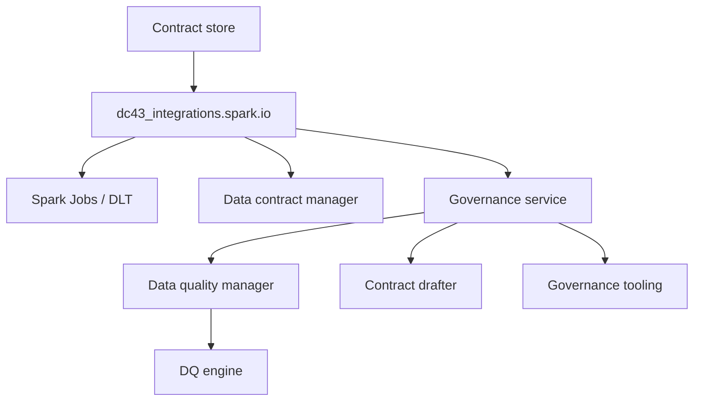

# Integration Layer (Spark & DLT Adapters)

dc43 keeps governance logic decoupled from runtime execution. The integration layer provides adapters that apply contracts, talk to the data contract manager, and call the governance service for verdicts while coordinating with platform-specific services such as Delta, Unity Catalog, or DLT expectations.

## Responsibilities

1. **Resolve runtime identifiers** (paths, tables, dataset versions) and map them to contract ids.
2. **Validate and coerce data** using helpers from `dc43_integrations.spark.data_quality` while respecting enforcement flags.
3. **Bridge runtime metrics** to the governance service so it can evaluate observations, record activity, and propose drafts when mismatches occur.
4. **Expose ergonomic APIs** for pipelines (`read_with_contract`, `write_with_contract`).



## Spark & Delta Helpers

The canonical implementation lives in [`src/dc43_integrations/spark`](../../src/dc43_integrations/spark):

* `io.py` — High-level `read_with_contract` and `write_with_contract` wrappers for Spark DataFrames along with dataset resolution helpers.
* `dlt.py` — Helpers to apply expectation predicates inside Delta Live Tables pipelines. Expectation SQL is supplied by the
  data-quality service via validation results so that Delta expectations mirror backend verdicts.
* [`dc43_integrations.spark.data_quality`](../../src/dc43_integrations/spark/data_quality.py) — Schema snapshots and metric builders that rely on expectation descriptors supplied by the data-quality service.
* [`dc43_service_clients.governance`](../../src/dc43_service_clients/governance) — Client APIs that link contracts, evaluate observations, and interact with governance backends.

Pipelines typically import these helpers directly:

```python
from dc43_integrations.spark.io import read_with_contract, write_with_contract, ContractVersionLocator
from dc43_service_clients.contracts import LocalContractServiceClient

contract_service = LocalContractServiceClient(store)
validated_df, status = read_with_contract(
    spark,
    contract_id="sales.orders",
    contract_service=contract_service,
    expected_contract_version=">=1.0.0",
    governance_service=governance,
    dataset_locator=ContractVersionLocator(dataset_version="latest"),
    return_status=True,
)
```

## Adding New Integrations

* **Engine adapters**: Port the same interface to warehouses (Snowflake), streaming platforms (Structured Streaming), or SQL endpoints.
* **Orchestration hooks**: Trigger contract resolution from workflow tools (Airflow, dbt, Databricks Jobs) by wrapping the integration API.
* **Platform-specific metadata**: Augment dataset ids with cluster/job identifiers or lineage metadata for governance audit trails.

Keep the integration layer thin: it should delegate to the contract drafter, DQ engine, and governance interfaces rather than re-implementing them.

### Feeding Delta Live Tables expectations

Quality enforcement inside DLT notebooks should reuse the SQL predicates computed by the data-quality service. When the
`write_with_contract` helper validates a dataset it returns a `ValidationResult` whose `details` dictionary includes an
`expectation_predicates` mapping whenever the backend can express expectations as SQL snippets. Pipelines can forward
this mapping directly to `apply_dlt_expectations` so that in-flight DLT expectations stay aligned with backend verdicts:

```python
import dlt
from collections.abc import Mapping
from dc43_integrations.spark.dlt import apply_dlt_expectations

@dlt.table
def orders():
    df = spark.read.table("bronze.orders_raw")
    dq_status = write_result.details  # captured from write_with_contract(...)
    predicates = dq_status.get("expectation_predicates")
    if isinstance(predicates, Mapping):
        apply_dlt_expectations(dlt, predicates)
    return df
```

This approach keeps the integration layer free from contract-specific logic while still enabling Delta expectations when
the backend surfaces SQL predicates. If a backend cannot provide predicates, the helper simply skips registering
expectations and DLT falls back to the default behaviour.

## Versioned layouts and Delta time travel

Dataset locators describe how an input or output path is derived from the contract
server definition. `ContractVersionLocator` keeps the legacy behaviour of nesting
the requested dataset version under the declared server root, which works well for
JSON/Parquet dumps. When the server format is `delta`, the locator now leaves the
path untouched and instead annotates Spark reads with the appropriate time-travel
options:

* Numeric dataset versions map to `option("versionAsOf", <version>)`.
* ISO-8601 timestamps (including the `Z` suffix) map to `option("timestampAsOf", <ts>)`.
* The sentinel value `latest` skips time travel entirely.

Custom locators can still override this behaviour—for example to glob subfolders
or derive dataset ids differently—but the default mapping means pipelines can
switch an input to Delta Lake simply by updating the ODCS server format without
touching application code.

### Encoding folder semantics in contracts

ODCS 3.x servers expose a `customProperties` array that dc43 now uses to keep the
filesystem layout self-describing.  When a server declares the
`dc43.versioning` property the integration layer inspects the metadata to
materialise concrete paths before the Spark read takes place.  The following
fields are supported:

* `includePriorVersions`: when `true` all folders whose name is lower-or-equal to
  the requested dataset version are included (useful for incremental feeds).
* `subfolder`: template applied to every version folder; accepts the
  `{version}` placeholder.
* `filePattern`: optional glob evaluated inside each folder.  Without it the
  folder itself is used as the read root.
* `readOptions`: static reader options merged into Spark (for example
  `{"recursiveFileLookup": true}` when loading JSON deltas stored in nested
  directories).

Contracts can still include a human-readable pattern such as
`dc43.pathPattern: data/orders/{<=version}/orders.json` so that implementers see
how the layout works, while dc43's runtime uses the structured `dc43.versioning`
payload to glob the correct files.  Output contracts can annotate Delta tables
with `{"mode": "delta", "timeTravel": "versionAsOf"}` to document that the
dataset version aligns with Delta Lake time-travel semantics.
