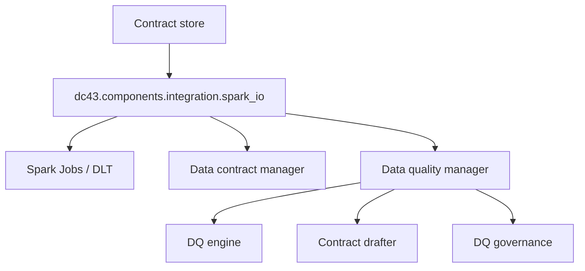

# Integration Layer (Spark & DLT Adapters)

dc43 keeps governance logic decoupled from runtime execution. The integration layer provides adapters that apply contracts, talk to the data contract manager, and ask the data quality manager for verdicts while coordinating with platform-specific services such as Delta, Unity Catalog, or DLT expectations.

## Responsibilities

1. **Resolve runtime identifiers** (paths, tables, dataset versions) and map them to contract ids.
2. **Validate and coerce data** using helpers from `dc43.components.data_quality.integration` while respecting enforcement flags.
3. **Bridge runtime metrics** to the data quality manager and contract drafter when mismatches occur.
4. **Expose ergonomic APIs** for pipelines (`read_with_contract`, `write_with_contract`, `expectations_from_contract`).



## Spark & Delta Helpers

The canonical implementation lives in [`src/dc43/components/integration`](../../src/dc43/components/integration):

* `spark_io.py` — High-level `read_with_contract` and `write_with_contract` wrappers for Spark DataFrames along with dataset resolution helpers.
* `dlt_helpers.py` — Functions to translate ODCS expectations into Delta Live Tables expectations.
* [`dc43.components.data_quality.integration`](../../src/dc43/components/data_quality/integration/__init__.py) — Schema snapshots, expectation predicates, and metric builders used by adapters.
* [`dc43.components.data_quality.manager`](../../src/dc43/components/data_quality/manager.py) — Facade that wraps governance adapters and draft generation.

Pipelines typically import these helpers directly:

```python
from dc43.components.integration.spark_io import (
    read_with_contract,
    write_with_contract,
    StaticDatasetLocator,
)

validated_df, status = read_with_contract(
    spark,
    contract_id="sales.orders",
    contract_store=store,
    expected_contract_version=">=1.0.0",
    dq_client=dq_client,
    dataset_locator=StaticDatasetLocator(format="delta"),
    return_status=True,
)
```

## Adding New Integrations

* **Engine adapters**: Port the same interface to warehouses (Snowflake), streaming platforms (Structured Streaming), or SQL endpoints.
* **Orchestration hooks**: Trigger contract resolution from workflow tools (Airflow, dbt, Databricks Jobs) by wrapping the integration API.
* **Platform-specific metadata**: Augment dataset ids with cluster/job identifiers or lineage metadata for governance audit trails.

Keep the integration layer thin: it should delegate to the contract drafter, DQ engine, and governance interfaces rather than re-implementing them.
