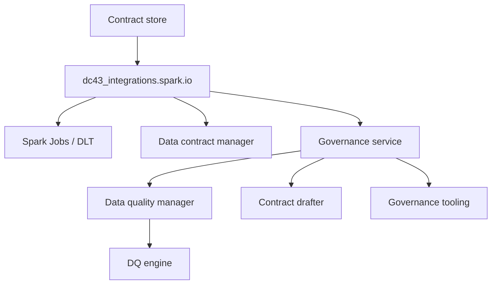

# Integration Layer (Spark & DLT Adapters)

dc43 keeps governance logic decoupled from runtime execution. The integration layer provides adapters that apply contracts, talk to the data contract manager, and call the governance service for verdicts while coordinating with platform-specific services such as Delta, Unity Catalog, or DLT expectations.

## Responsibilities

1. **Resolve runtime identifiers** (paths, tables, dataset versions) and map them to contract ids.
2. **Validate and coerce data** using helpers from `dc43_integrations.spark.data_quality` while respecting enforcement flags.
3. **Bridge runtime metrics** to the governance service so it can evaluate observations, record activity, and propose drafts when mismatches occur.
4. **Expose ergonomic APIs** for pipelines (batch: `read_with_governance`,
   `write_with_governance`; streaming: `read_stream_with_governance`,
   `write_stream_with_governance`).



## Spark & Delta Helpers

The canonical implementation lives in [`src/dc43_integrations/spark`](../../packages/dc43-integrations/src/dc43_integrations/spark):

* `io.py` — High-level batch (`read_with_governance`, `write_with_governance`) and
  streaming (`read_stream_with_governance`, `write_stream_with_governance`)
  wrappers for Spark DataFrames along with dataset resolution helpers.
* `dlt.py` — Helpers to apply expectation predicates inside Delta Live Tables pipelines. Expectation SQL is supplied by the
  data-quality service via validation results so that Delta expectations mirror backend verdicts.
* [`dc43_integrations.spark.data_quality`](../../packages/dc43-integrations/src/dc43_integrations/spark/data_quality.py) — Schema snapshots and metric builders that rely on expectation descriptors supplied by the data-quality service.
* [`dc43_service_clients.governance`](../../packages/dc43-service-clients/src/dc43_service_clients/governance) — Client APIs that link contracts, evaluate observations, and interact with governance backends.

Pipelines typically import these helpers directly. The annotations mirror the
``read_with_governance``/``write_with_governance`` wrappers—only the governance
client is required, which resolves the contract, fetches expectation plans, and
records activity on behalf of the pipeline:

```python
from dc43_integrations.spark.io import (
    read_with_governance,
    write_with_governance,
    ContractVersionLocator,
    GovernanceSparkReadRequest,
)
from dc43_service_clients import load_governance_client

governance = load_governance_client()
validated_df, status = read_with_governance(
    spark,
    GovernanceSparkReadRequest(
        context={
            "contract": {
                "contract_id": "sales.orders",
                "version_selector": ">=1.0.0",
            }
        },
        dataset_locator=ContractVersionLocator(dataset_version="latest"),
    ),
    governance_service=governance,
    return_status=True,
)
```

## Adding New Integrations

* **Engine adapters**: Port the same interface to warehouses (Snowflake), streaming platforms (Structured Streaming), or SQL endpoints.
* **Orchestration hooks**: Trigger contract resolution from workflow tools (Airflow, dbt, Databricks Jobs) by wrapping the integration API.
* **Platform-specific metadata**: Augment dataset ids with cluster/job identifiers or lineage metadata for governance audit trails.

Keep the integration layer thin: it should delegate to the contract drafter, DQ engine, and governance interfaces rather than re-implementing them.

### Feeding Delta Live Tables expectations

Quality enforcement inside DLT notebooks should reuse the SQL predicates computed by the governance stack. When a
pipeline is declarative you can attach the contract directly to a table/view definition with
:func:`~dc43_integrations.spark.dlt.contract_table` or :func:`~dc43_integrations.spark.dlt.contract_view`. The decorators
resolve the requested contract through the governance service, ask it for the expectation plan, and register the resulting predicates
with DLT while wrapping ``@dlt.table`` / ``@dlt.view``:

```python
import dlt
from dc43_integrations.spark.dlt import contract_table
from dc43_service_clients import load_governance_client

governance = load_governance_client()


@contract_table(
    dlt,
    context={
        "contract": {
            "contract_id": "sales.orders",
            "version_selector": ">=1.2.0",
        }
    },
    governance_service=governance,
    name="orders",
)
def orders():
    return spark.read.table("bronze.orders_raw")
```

The decorated function keeps a ``__dc43_contract_binding__`` attribute containing the resolved contract id/version and
the frozen expectation plan so orchestration steps can forward the metadata to governance tooling. Equivalent helpers
exist for views (``contract_view``), and the lower-level
:func:`~dc43_integrations.spark.dlt.expectations_from_validation_details` helper remains available when a pipeline wants
to recycle predicates produced by :func:`~dc43_integrations.spark.io.write_with_governance` or manual evaluations; the
returned :class:`~dc43_integrations.spark.dlt.DLTExpectations` object exposes both decorator and imperative application
methods.

### Local testing without Databricks

Install [`databricks-dlt`](https://pypi.org/project/databricks-dlt/) alongside
``pyspark`` to obtain the official Delta Live Tables notebook shims. When the
package is missing dc43 falls back to a tiny in-repo stub so tests can still
exercise the helpers, but installing the upstream wheel keeps the experience
closest to production. :class:`~dc43_integrations.spark.dlt_local.LocalDLTHarness`
then patches the ``dlt`` module to register/execute the assets and record the
outcome of every expectation evaluation:

```python
from pyspark.sql import SparkSession

from dc43_integrations.spark.dlt import contract_table
from dc43_integrations.spark.dlt_local import LocalDLTHarness, ensure_dlt_module
from dc43_service_clients import load_governance_client

spark = SparkSession.builder.master("local[2]").appName("demo").getOrCreate()
dlt = ensure_dlt_module(allow_stub=True)
governance = load_governance_client()

with LocalDLTHarness(spark, module=dlt) as harness:

    @contract_table(
        dlt,
        name="orders",
        context={
            "contract": {
                "contract_id": "demo.orders",
                "version_selector": "latest",
            }
        },
        governance_service=governance,
    )
    def orders():
        return spark.read.table("bronze.orders_raw")

    validated = harness.run_asset("orders")

for report in harness.expectation_reports:
    print(report.asset, report.rule, report.status, report.failed_rows)
```

A ready-to-run example lives under
``packages/dc43-integrations/examples/dlt_contract_pipeline.py``. After
installing the dependencies (`pip install pyspark==3.5.1 databricks-dlt` along
with the root project), execute::

    python packages/dc43-integrations/examples/dlt_contract_pipeline.py

The script materialises a tiny bronze dataset, decorates a DLT table with
``contract_table``, prints the expectation summary emitted by the harness, and
optionally persists the validated rows when ``--output`` is provided.

## Versioned layouts and Delta time travel

Dataset locators describe how an input or output path is derived from the contract
server definition. `ContractVersionLocator` keeps the legacy behaviour of nesting
the requested dataset version under the declared server root, which works well for
JSON/Parquet dumps. When the server format is `delta`, the locator now leaves the
path untouched and instead annotates Spark reads with the appropriate time-travel
options:

* Numeric dataset versions map to `option("versionAsOf", <version>)`.
* ISO-8601 timestamps (including the `Z` suffix) map to `option("timestampAsOf", <ts>)`.
* The sentinel value `latest` skips time travel entirely.

Custom locators can still override this behaviour—for example to glob subfolders
or derive dataset ids differently—but the default mapping means pipelines can
switch an input to Delta Lake simply by updating the ODCS server format without
touching application code.

### Encoding folder semantics in contracts

ODCS 3.x servers expose a `customProperties` array that dc43 now uses to keep the
filesystem layout self-describing.  When a server declares the
`dc43.core.versioning` property the integration layer inspects the metadata to
materialise concrete paths before the Spark read takes place.  The following
fields are supported:

* `includePriorVersions`: when `true` all folders whose name is lower-or-equal to
  the requested dataset version are included (useful for incremental feeds).
* `subfolder`: template applied to every version folder; accepts the
  `{version}` placeholder.
* `filePattern`: optional glob evaluated inside each folder.  Without it the
  folder itself is used as the read root.
* `readOptions`: static reader options merged into Spark (for example
  `{"recursiveFileLookup": true}` when loading JSON deltas stored in nested
  directories).

Contracts can still include a human-readable pattern such as
`dc43.pathPattern: data/orders/{<=version}/orders.json` so that implementers see
how the layout works, while dc43's runtime uses the structured `dc43.core.versioning`
payload to glob the correct files.  Output contracts can annotate Delta tables
with `{"mode": "delta", "timeTravel": "versionAsOf"}` to document that the
dataset version aligns with Delta Lake time-travel semantics.
