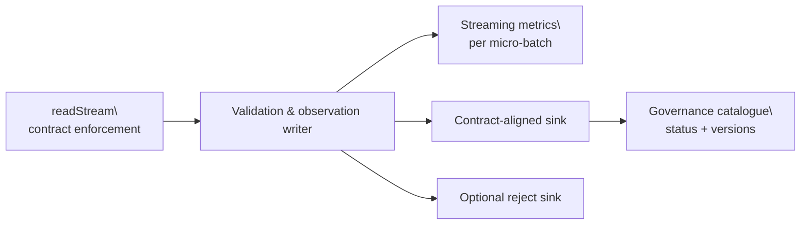

# Spark streaming integration

The Spark helpers in `dc43_integrations` can build Structured Streaming
pipelines that continue to enforce Open Data Contracts and coordinate with the
data-quality and governance services.  Batch APIs remain unchanged while
dedicated helpers such as `read_stream_with_contract`,
`read_stream_from_contract`, and `write_stream_with_contract` route through
`SparkSession.readStream` / `DataFrame.writeStream` without threading a flag
through the batch code paths.

Streaming IO still performs contract validation and posts schema observations to
governance.  When a streaming write is executed the helper also launches a
dedicated observation writer that materialises the contract expectations for
each micro-batch via `foreachBatch`, forwarding the resulting metrics back to
the attached data-quality client and updating the returned validation payload.
Reads remain schema-only until a sink materialises the stream, but write
validations now produce live metrics without blocking the ingestion job.  The
validation result contains every `streaming_query` started by the helpers so
callers can manage their lifecycle.  Read and write validations also expose the
`dataset_id` and `dataset_version` they submit to governance so micro-batch
monitors can query the data-quality service for the latest verdict or trigger
asynchronous metric computation when a streaming snapshot needs to be
inspected.



The observation writer populates a `streaming_batches` array on every
`ValidationResult`. Each entry records the batch identifier, row count,
violation totals, timestamps, and any intervention reason supplied by a
`StreamingInterventionStrategy`. Governance submissions reuse the same dataset
identifier/version metadata so operators can reconcile the timeline displayed in
the demo application with the service-side records. The demo also persists each
micro-batch as an individual dataset history entry and links directly to the
governed input/reject datasets so presenters can pivot from the streaming run to
the catalog views in a single click.

When you need to surface live progress in your own applications, pass an
`on_streaming_batch` callback to `write_stream_with_contract` (and the data
product variants). The callback receives the same batch payloads that populate
`streaming_batches`, enabling UI layers to animate micro-batch throughput or
intervention status without waiting for the run to complete.

Observation writers are single-use helpers and can be paired with a
`StreamingInterventionStrategy` to take action after repeated issues: the
strategy receives the validation result for every batch and can decide to block
the pipeline, surface warnings, or trigger alternative routing (for example by
switching over to a rejection sink).  The default implementation never blocks,
preserving the previous behaviour when no strategy is supplied.

Explore the functionality inside the demo application: the pipeline UI exposes
three pre-wired streaming scenarios that reuse the same helpers to showcase
healthy runs, reject routing, and schema drift. See
[the streaming scenarios walkthrough](../tutorials/spark-streaming-scenarios.md)
for screenshots and an operator-focused tour.

Programmatic access is exposed through ``dc43_demo_app.streaming`` so the demo
can be exercised from unit tests or local REPL sessions:

```python
from dc43_demo_app.streaming import run_streaming_scenario

# Healthy pipeline that records governed dataset versions for every batch.
run_streaming_scenario("streaming-valid", seconds=5, run_type="observe")

# Route rejects without halting the main sink.
run_streaming_scenario("streaming-dq-rejects", seconds=5, run_type="observe")

# Drop a required column to observe the schema drift failure.
run_streaming_scenario("streaming-schema-break", seconds=3, run_type="enforce")
```

Data-product bindings participate in the same streaming workflow: registering a
streaming port via `read_stream_from_data_product`, `read_stream_with_contract`,
or the streaming `write_*` counterparts will validate the contract, update the
governance catalogue, and return any active `StreamingQuery` handles through the
validation payload.
