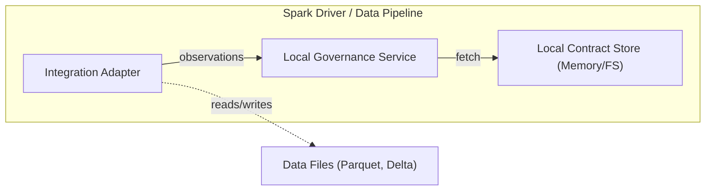
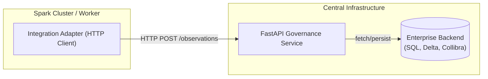
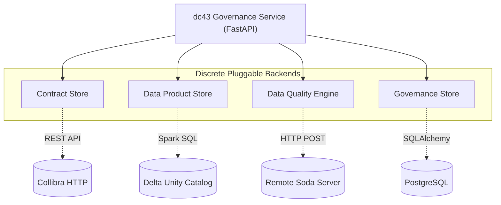

# Infrastructure and Adapters

dc43 is built aggressively around decoupling: **engines process data, while the governance platform evaluates logic**. To support this, dc43 can be deployed across a variety of infrastructure patterns.

## Infrastructure Deployment Models

dc43 components can be configured to run fully embedded inside your data pipelines, or as a centralized, remote shared service. 

### 1. Embedded / Local Mode
In Local Mode, the `governance_service` and `contract_store` are imported and run directly within the memory space of your data pipeline (e.g., inside the Spark driver).

- **Pros:** Zero infrastructure footprint. No network calls. Great for testing, CI/CD pipelines, or isolated environments.
- **Cons:** Contracts are not centrally managed. Lineage is not easily queryable across the enterprise.

*(To configure Local Mode components, see the **[Service Backends Configuration](operations/service-backends-configuration.md)** guide.)*

### 2. Remote / Shared Service Mode
In Remote Mode, the `governance_service` is deployed as a standalone HTTP API (using FastAPI/Uvicorn). The Data Pipelines use a lightweight HTTP client (the "Remote Adapter") to interact with the service.

- **Pros:** A single source of truth for all contracts. Centralized dataset lineage, metric collection, and observability. Interoperability across different compute technologies (e.g., Spark, Flink, Python Pandas).
- **Cons:** Requires operations teams to deploy and maintain an internal REST API.

*(To configure Remote Mode backends like SQL, Delta, or Collibra, see the **[Service Backends Configuration](operations/service-backends-configuration.md)** guide.)*

---

## Polyglot Persistence (Mix and Match Stores)

A key architectural feature of dc43 is that **the backend services are fully decoupled from each other**. You are not forced to pick a single enterprise backend for the entire platform.

Because the system is broken down into discrete stores (`contract_store`, `data_product_store`, `data_quality`, and `governance_store`), you can configure each one to use a completely different underlying technology at the exact same time.

For example, a typical Enterprise deployment might configure its `dc43-service-backends` to:
- Fetch and sync **Contracts** from a live **Collibra HTTP** instance.
- Persist **Data Products** inside a **Delta Unity Catalog** table.
- Evaluate **Data Quality** using a remote **Soda HTTP** engine.
- Record all **Governance Observations & Lineage** into a central **PostgreSQL** database.

This "polyglot persistence" guarantees that dc43 integrates cleanly into your existing corporate data stack, no matter where your catalogs or observability platforms live.

*(Detailed configurations for mixing and matching these elements are available in the **[Service Backends Configuration](operations/service-backends-configuration.md)** guide.)*

---

## What are Adapters?

**Adapters (or Integrations)** are the glue packages that bridge a specific compute engine to the dc43 Governance Service. 

Why do we need them? Because the Governance Service only understands universal Open Data Contract Standard (ODCS) payloads—it does not know how to read Parquet files, connect to Snowflake, or launch Spark jobs.

### The Role of an Adapter

An adapter has three main responsibilities:
1. **Resolution**: Translate a `ContractReference` or `PipelineContext` into a physical path/table compatible with the target engine.
2. **Execution**: Push the computation (schema casting, counting rows, running SQL expectations) down into the engine.
3. **Delegation**: Package the computed metrics (the "Observations") into a standard JSON payload and send them to the `governance_service` for a policy decision, respecting whether to `block` or `warn` based on the response.

### Available Adapters

Currently, dc43 supports the following primary integrations out-of-the-box (under `dc43_integrations`):

- **[Spark](user-guide/reading-data.md)**: PySpark adapters for Batch DataFrames (`read_with_governance`, `write_with_governance`).
- **[Spark/Structured Streaming](user-guide/handling-violations.md)**: PySpark adapters for intercepting streaming micro-batches.
- **[Delta Live Tables (DLT)](tutorials/spark-dlt.md)**: An adapter that converts ODCS metrics into declarative `@dlt.expect` annotations so that Databricks can natively enforce the contracts.

Writing a new adapter (for example, for Snowflake, Trino, or open-source Pandas) involves writing a module that implements the 3 rules above, acting as a client to the `governance_service`.
